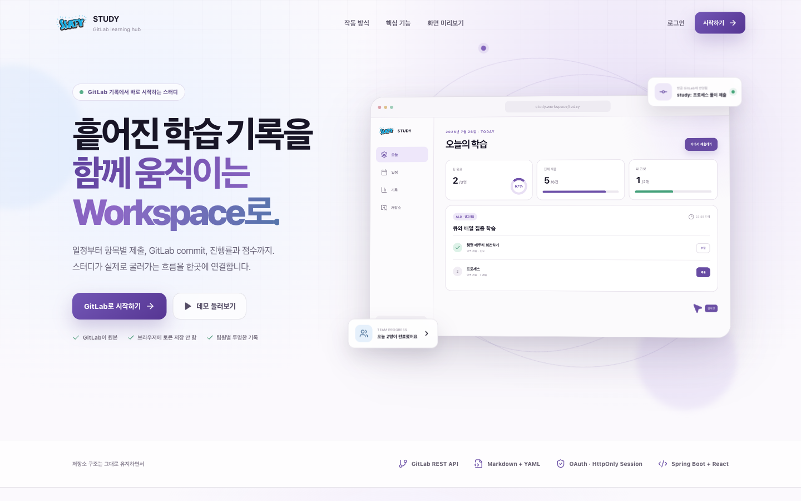
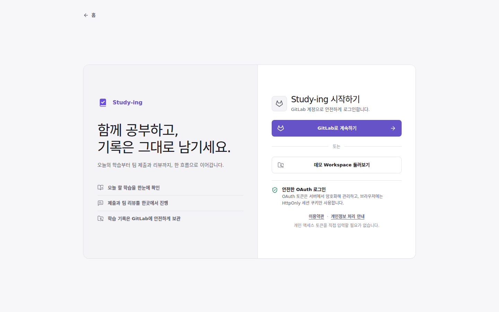
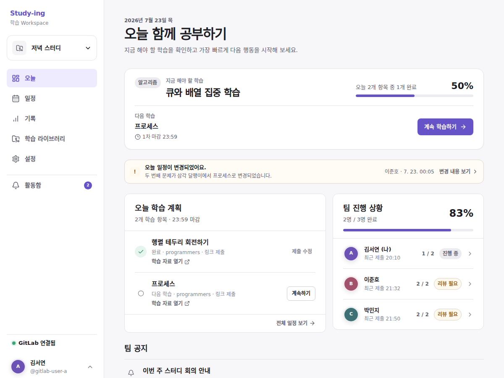
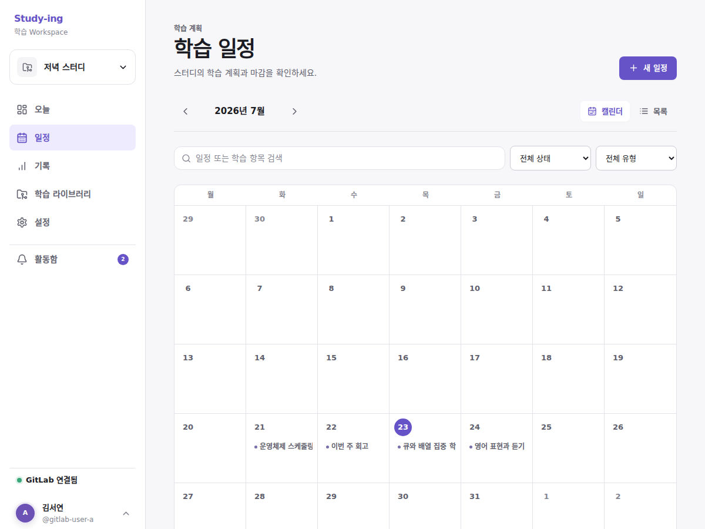
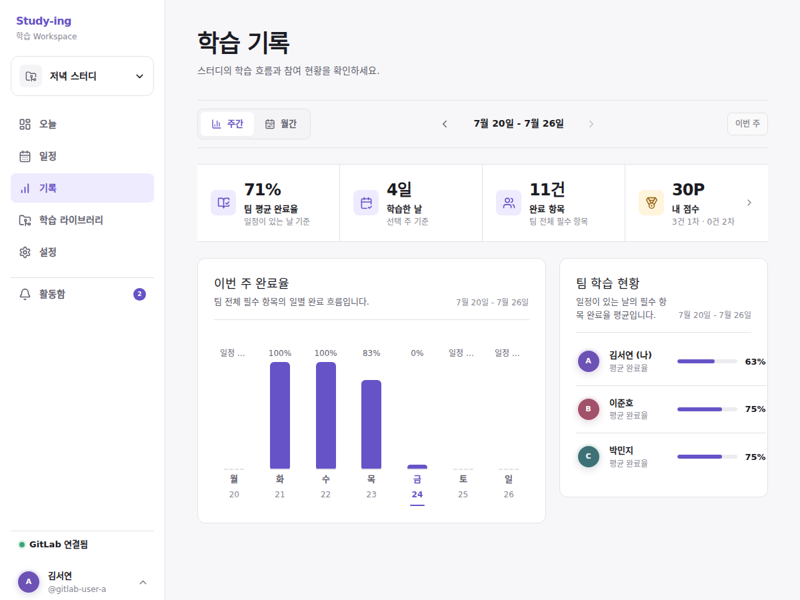
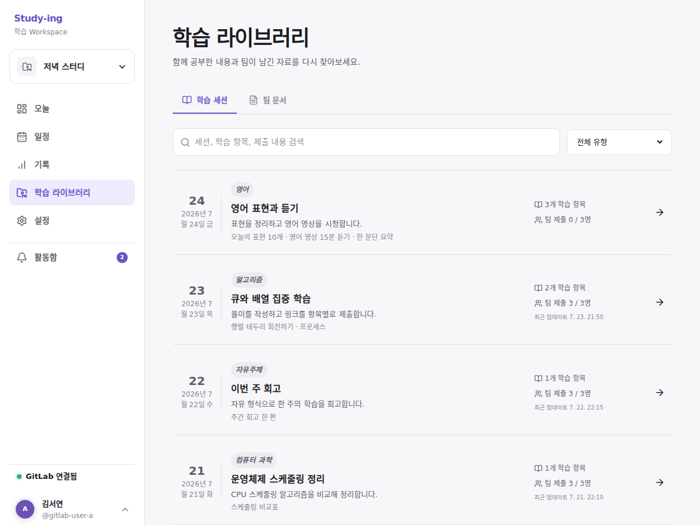
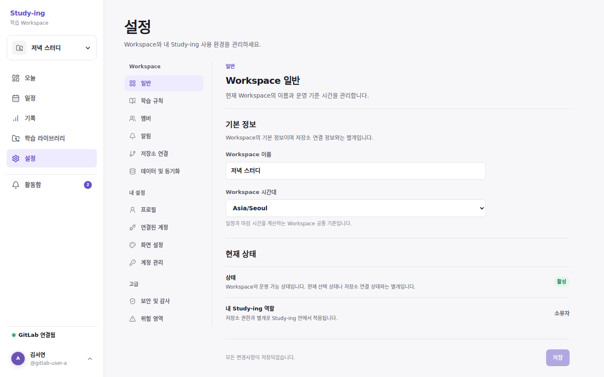

# Study Workspace

> GitLab 저장소를 학습 기록의 원본으로 유지하면서, 팀원의 진행 상황과 일정·제출·기록을 웹에서 편하게 관리하는 스터디 플랫폼



## 프로젝트를 시작한 배경

SSAFY 입과 후 교육을 받으며 팀원들과 알고리즘 스터디를 시작했습니다. 우리 팀은 각자 블로그에 풀이 코드와 리뷰를 작성하고, 별도의 GitLab 프로젝트에도 날짜별 디렉터리를 만든 뒤 개인 파일을 하나씩 올리기로 했습니다.

처음에는 이미 블로그에 정리한 링크를 GitLab에 날짜별로 다시 모아야 하는 이유가 궁금했습니다. 팀장은 이 구조가 팀원별 학습 여부를 확인하고 스터디 진행 상황을 함께 관리하기 편하기 때문이라고 설명했습니다.

그 설명을 들으며 GitLab에 기록을 남기는 방식 자체는 유용하지만, 매번 날짜 디렉터리와 각자의 파일을 직접 열어보는 과정은 웹서비스로 더 편하게 만들 수 있겠다고 생각했습니다. 여기서 다음 아이디어가 출발했습니다.

- GitLab에 쌓인 학습 기록을 한눈에 보여주는 대시보드
- 팀원별 제출 여부와 진행률 비교
- 날짜별 학습 일정과 여러 학습 항목 관리
- 1차·2차 마감과 제출 시각을 활용한 점수 및 순위
- Git에 익숙하지 않아도 웹에서 제출하고 자신의 계정으로 커밋하는 기능
- 알고리즘뿐 아니라 영어, CS, 자유주제 스터디에도 적용할 수 있는 공통 구조

Study Workspace는 GitLab을 대체하는 서비스가 아닙니다. GitLab 저장소를 원본으로 유지하고, 사용자가 저장소의 내용을 더 쉽게 읽고 수정할 수 있는 인터페이스를 제공하는 것이 목표입니다.

## 해결하려는 문제

기존 스터디 방식에는 다음과 같은 불편이 있었습니다.

- 날짜별 디렉터리와 멤버 파일을 하나씩 열어야 전체 진행 상황을 알 수 있습니다.
- 하루에 여러 항목을 공부하면 단순 제출 여부만으로는 부분 진행 상태를 표현하기 어렵습니다.
- 문제나 과제가 변경되면 기존 제출과 현재 학습 기준이 어긋날 수 있습니다.
- 블로그 링크를 다시 GitLab 파일에 정리하고 직접 커밋해야 합니다.
- Git 사용이 익숙하지 않은 팀원에게는 반복적인 커밋과 푸시가 부담이 될 수 있습니다.
- 1차·2차 마감이 있어도 최종 제출 여부 외에는 참여 시점을 비교하기 어렵습니다.

Study Workspace는 이 과정을 `일정 생성 → 항목별 제출 → GitLab 커밋 → 진행률·점수 집계` 흐름으로 연결합니다.

## 핵심 설계 원칙

### GitLab 저장소가 원본입니다

`session.yml`, 멤버별 Markdown, 제출 코드와 커밋 이력은 GitLab에 저장합니다. 애플리케이션 DB에는 사용자, OAuth 토큰, Workspace 연결과 같은 서비스 운영 데이터만 저장합니다.

### Workspace 하나는 GitLab 프로젝트 하나와 연결됩니다

프론트엔드는 임의의 GitLab 프로젝트 ID나 파일 경로를 직접 조합하지 않습니다. Spring 백엔드가 Workspace에 연결된 프로젝트와 허용된 파일 경로를 확인한 뒤 GitLab API를 호출합니다.

### 위험 작업은 역할로 제한합니다

모든 활성 멤버가 일정과 제출 흐름에 참여하지만 프로젝트 연결, 멤버 역할, Workspace 삭제 같은 위험 작업은 Owner/Manager 정책으로 제한합니다. 실제 파일 읽기·쓰기는 각 사용자의 GitLab 권한과 브랜치 보호 규칙을 따릅니다.

### 충돌이 발생하면 덮어쓰지 않습니다

일정은 `revision`, GitLab 파일은 `last_commit_id`를 기준으로 최신 상태를 확인합니다. 같은 제출이나 일정이 동시에 변경되면 자동으로 덮어쓰지 않고 충돌로 처리합니다.

## 현재 구현된 기능

프론트엔드 UI와 Spring Boot 도메인 API가 연결되어 일정·제출·설정 변경, 대시보드·기록·점수 계산을 HTTP 요청으로 처리합니다. GitLab OAuth 로그인, 사용자별 프로젝트 검색과 첫 Workspace 온보딩, Spring Security/CSRF/멤버십 경계, 암호화 credential과 JDBC 세션 저장을 구현했습니다. 일정은 실제 `session.yml`, 개인 제출은 실제 멤버 Markdown 파일로 OAuth 사용자 권한을 사용해 커밋하며, GitLab 원본 기준의 부분 실패 안전 동기화로 일정과 제출을 다시 가져옵니다.

| 화면 | 구현 내용 |
|---|---|
| 랜딩 | 서비스 소개, GitLab 기반 워크플로, 자동 전환 제품 미리보기, 스크롤 애니메이션 |
| 로그인 | GitLab OAuth 진입, 최초 프로필·표시 이름·GitLab 기록 이름·약관 동의, 운영 모드와 명시적 데모 모드 분리 |
| 온보딩 | OAuth 사용자의 프로젝트 검색·접근 확인, 기존 저장소 읽기 전용 분석, 충돌 방지, 전용 `.study-workspace` 경로와 첫 Workspace 생성 |
| 오늘 | 오늘의 학습 항목, 팀 진행률, 개인 진행률, 멤버 현황, 저장소 미리보기 |
| 일정 | 일정 검색·필터, 여러 학습 항목, 1차·2차 마감, 실제 GitLab `session.yml` 생성·수정·취소·재동기화, revision·commit SHA 표시 |
| 제출 | 항목별 링크·텍스트·코드 제출, 커밋 메시지, OAuth 기반 GitLab 멤버 Markdown 생성·수정과 commit SHA 표시 |
| 기록 | 일별·월별 전환, 날짜·월 이동, 달력, 주간 제출률, 멤버별 평균 |
| 점수 | 1차 제출 10P, 2차 제출 6P, 개인 점수 카드, 카드 클릭형 멤버 순위 모달 |
| 저장소 | 날짜 폴더 탐색, 파일 검색, 폴더 접기, YAML 원문·GFM Markdown 미리보기, 커밋 정보 |
| 설정 | 프로젝트 연결 정보, 멤버와 GitLab 권한, 알림, 보안 원칙 |
| 반응형 UI | 데스크톱·태블릿·모바일 레이아웃과 모바일 전체 화면 모달 |
| GitLab 연결 스파이크 | 사용자·프로젝트·tree·파일 조회, 임시 브랜치 파일 생성·수정·삭제와 정리 검증 |
| Workspace API | Workspace·멤버·일정·제출·Dashboard·기록·점수·저장소 REST API, revision 충돌과 입력 검증 |
| DB 영속화 | 사용자·암호화 OAuth credential·Workspace 상태/cache·sync job·알림·감사 로그를 Flyway/JPA DB에 저장하고 기존 운영 JSON을 최초 1회 이관 |
| 인증·데이터 경계 | 비로그인 API 차단, Workspace 활성 멤버 검증, CSRF, 운영 모드 seed fallback 금지 |
| OAuth 영속화 | JPA/Flyway 사용자 upsert, AES-GCM credential 암호화, Spring Session JDBC |

## 화면 소개

아래 이미지는 실제 로컬 프론트엔드를 1440×900 데스크톱 환경에서 캡처한 화면입니다.

### 랜딩

서비스의 문제 정의와 `일정 → 웹 제출 → GitLab commit → 진행률` 흐름을 소개합니다. 제품 화면을 재구성한 Hero 애니메이션, 자동으로 전환되는 기능 미리보기, 스크롤 등장 효과와 모션 감소 접근성 설정을 포함합니다.


### 로그인

별도의 비밀번호 대신 GitLab Authorization Code 방식으로 로그인합니다. 백엔드는 `state`를 검증하고 code를 access/refresh token으로 교환한 뒤 HttpOnly 세션 쿠키를 발급합니다. 데모 UI는 운영 화면에 노출하지 않고 명시적인 앱 모드로만 실행합니다.



### 오늘

선택 날짜의 학습 항목과 일정 변경 사항을 확인하고, 팀·개인 진행률을 비교합니다. 항목별 제출·수정 버튼에서 링크, 텍스트 또는 코드와 커밋 메시지를 작성할 수 있으며 저장소와 멤버 진행 현황도 한 화면에서 확인할 수 있습니다.



### 일정

날짜별 스터디 일정을 카드로 탐색하고 유형·상태·키워드로 필터링합니다. 새 일정을 만들거나 기존 일정을 편집하면서 여러 학습 항목, 제출 방식, 1차·2차 마감과 Session revision을 관리합니다.



### 기록

일별·월별 보기를 전환하고 날짜 또는 월을 이동하면서 제출률, 학습 일수, 총 제출 수와 현재 점수를 확인합니다. 주간 그래프와 월간 달력으로 흐름을 살펴보고 점수 카드를 누르면 멤버 순위 모달을 열 수 있습니다.



### 저장소

연결된 GitLab 프로젝트의 폴더와 파일을 검색·탐색하는 읽기 전용 화면입니다. Markdown 파일은 GFM 표와 문서 구조가 적용된 미리보기 또는 원문으로 전환할 수 있고, 다른 텍스트·YAML 파일도 안전하게 확인할 수 있습니다.



### 설정

Workspace에 연결된 GitLab 프로젝트, Project ID, 기본 브랜치와 지역 정보를 확인합니다. 멤버별 GitLab 권한과 제출 파일 매핑, 알림 설정, 토큰과 파일 접근에 대한 보안 원칙도 함께 관리합니다.



## 개발 과정

현재까지의 기획과 프론트엔드는 다음 흐름으로 발전했습니다.

1. SSAFY 알고리즘 스터디 경험에서 문제와 아이디어를 정의했습니다.
2. 사용 흐름, GitLab 저장 구조, 일정·제출·진행률 정책을 구체화했습니다.
3. Claude Design을 활용해 초기 프론트 디자인을 구성했습니다.
4. Codex CLI를 활용해 페이지 구조, 반응형 UI, 모달, 필터, 기록·점수 기능과 세부 상호작용을 보완했습니다.
5. 데스크톱과 모바일 화면을 실제 브라우저에서 반복 검증했습니다.
6. Spring Boot 공통 GitLab 클라이언트와 읽기 API를 구현했습니다.
7. 기본 브랜치와 분리된 일회성 브랜치에서 파일 생성·수정·삭제를 실제 GitLab로 검증했습니다.

AI 도구는 디자인과 구현을 구체화하는 협업 도구로 사용했습니다. 실제 스터디 경험을 바탕으로 한 문제 정의, 기능 선택, 정책 결정과 최종 검증은 프로젝트 요구사항에 맞춰 지속적으로 조정하고 있습니다.

## 기술 구성

### 현재 프론트엔드

- React 19
- Next.js 16
- TypeScript
- Vinext / Vite
- CSS
- Lucide React

### 백엔드

- Java
- Spring Boot
- Spring MVC
- Spring Security / Spring Session JDBC
- Spring Data JPA
- WebClient
- PostgreSQL
- Redis 또는 Spring Session
- GitLab REST API
- JUnit, Testcontainers, WireMock

## 예정 아키텍처


> 편집 가능한 원본: [study-workspace-architecture.svg](docs/images/study-workspace-architecture.svg)

브라우저와 JDBC 세션에는 GitLab 토큰을 저장하지 않습니다. OAuth credential은 AES-GCM으로 암호화해 DB에 보관하고, 브라우저에는 HttpOnly 세션 쿠키만 전달합니다.

## 백엔드 구현 전 GitLab 연결 검증

전체 백엔드를 만들기 전에 다음 최소 흐름부터 확인합니다.

```text
프론트
→ Spring Boot
→ GitLab 사용자 확인
→ 테스트 프로젝트 접근 확인
→ 기본 브랜치와 repository tree 조회
→ 파일 조회
→ 테스트 브랜치에 임시 파일 커밋
```

초기 GitLab 연결 진단 스파이크만 `dev`/`local` 프로필에서 서버 Personal Access Token을 선택적으로 사용합니다. 사용자 인증, 프로젝트 검색·검증과 실제 일정·제출 파일 읽기·쓰기는 `api` scope의 GitLab OAuth Bearer token으로 동작하며 브라우저에 토큰을 저장하지 않습니다. GitLab 커밋에는 사용자가 최초 프로필에서 지정한 표시 이름을 `author_name`으로 전달합니다.

## 백엔드 역할 분담

백엔드는 계층별로 나누지 않고, 각 팀원이 하나의 기능 영역을 Controller부터 GitLab 연동과 테스트까지 끝까지 구현하는 방식으로 진행합니다.

| 담당 | 영역 | 주요 책임 | 요구사항 | 초심자 구현 핸드북 |
|---|---|---|---|---|
| 팀원 1 | 인증·Workspace | GitLab OAuth, 사용자·토큰, 프로젝트 연결, Workspace와 멤버 | [역할 문서](docs/backend-role-1-auth-workspace.md) | [클래스·DB·OAuth 구현 순서](docs/guides/member-1-auth-workspace-handbook.md) |
| 팀원 2 | 일정·저장소 | Session CRUD, `session.yml`, 1·2차 마감, revision, tree·파일 조회 | [역할 문서](docs/backend-role-2-session-repository.md) | [클래스·YAML·충돌 구현 순서](docs/guides/member-2-session-repository-handbook.md) |
| 팀원 3 | 제출·기록 | 개인 제출 병합, 커밋, 완료율, 일별·월별 기록, 점수·순위 | [역할 문서](docs/backend-role-3-submission-analytics.md) | [클래스·Markdown·통계 구현 순서](docs/guides/member-3-submission-analytics-handbook.md) |

세 영역이 공통으로 사용하는 GitLab HTTP 통신은 `GitLabRepositoryPort`와 하나의 클라이언트 구현으로 통합합니다. 각 기능에서 WebClient 호출을 중복 구현하지 않습니다.

세 명이 개발을 시작하기 전에는 [팀 구현 로드맵](docs/team-implementation-roadmap.md)의 공통 계약 단계부터 함께 진행합니다.

## 추천 개발 순서

### 1단계 — 프론트엔드와 도메인 검증

- 주요 페이지와 반응형 UI 구현
- 일정·제출·기록·점수 정책 검증
- 메모리 목업을 이용한 전체 사용자 흐름 확인

### 2단계 — GitLab 연결 스파이크

- 테스트 GitLab 프로젝트 준비
- Spring Boot에서 사용자·프로젝트·브랜치 조회
- repository tree와 파일 조회
- 테스트 브랜치 파일 생성·수정
- 공통 GitLab 클라이언트와 오류 형식 확정

### 3단계 — 역할별 백엔드 구현

- 팀원별 기능 영역을 독립적으로 구현
- OpenAPI 명세와 테스트를 기능 단위로 작성
- 기능 담당자가 아닌 팀원이 Pull Request 리뷰

### 4단계 — 프론트엔드 통합

- `WorkspaceProvider`의 메모리 액션을 실제 API 호출로 교체
- 로딩·빈 상태·권한 오류·GitLab 장애·충돌 UI 연결
- 실제 커밋 결과와 진행률·점수 재계산 확인

### 5단계 — 운영 준비

- OAuth token refresh 검증과 분산 세션 저장소
- 보호 브랜치 및 권한 테스트
- 로그에서 토큰과 민감정보 마스킹
- 캐시 무효화와 GitLab API 요청 제한 대응
- 배포 환경 구성과 E2E 테스트

## 프로젝트 구조

```text
study_platform/
├── frontend/                              # 현재 구현된 프론트엔드
│   └── lib/api/                           # Spring API 연동 계층
├── backend/                               # Spring Boot 패키지 골격
│   └── src/
│       ├── main/java/com/studyworkspace/  # 기능별 백엔드 패키지
│       ├── main/resources/db/migration/   # Flyway 마이그레이션
│       └── test/                          # 기능별 테스트와 fixture
├── docs/                                  # 역할 분담과 개발 문서
├── output/playwright/                     # 브라우저 UI 검증 결과
├── README.md                              # 프로젝트 소개
└── STUDY_WORKSPACE_BACKEND_API_GITLAB.md  # 백엔드·API·GitLab 상세 설계
```

`backend/`에는 Spring Boot 실행 구조와 GitLab 읽기 연결 스파이크가 구현되어 있습니다. 실제 토큰과 프로젝트는 Git에 넣지 않고 로컬 환경변수로 설정합니다.

## 프론트엔드 실행

Node.js 22.13 이상이 필요합니다.

```bash
cd frontend
npm install
npm run dev
```

기본 개발 주소:

```text
http://localhost:3000         # 랜딩
http://localhost:3000/login   # GitLab 로그인
http://localhost:3000/today   # 데모 Workspace
```

## 백엔드 실행

실제 GitLab 연결 값은 [백엔드 실행 문서](backend/README.md)를 참고해 `backend/.env`에 입력합니다.

```bash
cd backend
cp .env.example .env
# .env에 GitLab 주소, read_api 토큰, 프로젝트 ID 입력
set -a
source .env
set +a
./gradlew bootRun
```

기본 API 주소는 `http://localhost:8080`입니다. 환경변수가 없으면 서버는 실행되지만 GitLab 연결 상태는 `NOT_CONFIGURED`로 표시됩니다.

검증:

```bash
cd frontend
npm run build
npm run lint
npm test
```

## 관련 문서

- [3인 팀 백엔드 구현 로드맵](docs/team-implementation-roadmap.md)
- [백엔드·API·GitLab 전체 설계서](STUDY_WORKSPACE_BACKEND_API_GITLAB.md)
- [OpenAPI 실행 계약](docs/openapi.yaml)
- [API 공통 오류 계약](docs/api-error-catalog.md)
- [GitLab CI 사용 가이드](docs/ci-guide.md)
- [로컬 개발환경 가이드](docs/development-environment.md)
- [협업 및 Merge Request 가이드](CONTRIBUTING.md)
- [Spring 백엔드 디렉터리 구조](backend/README.md)
- [프론트엔드 실행 및 구조](frontend/README.md)
- [프론트 API 연동 구조](frontend/lib/api/README.md)
- [팀원 1 — 인증·Workspace](docs/backend-role-1-auth-workspace.md)
- [팀원 1 초심자 구현 핸드북](docs/guides/member-1-auth-workspace-handbook.md)
- [팀원 2 — 일정·저장소](docs/backend-role-2-session-repository.md)
- [팀원 2 초심자 구현 핸드북](docs/guides/member-2-session-repository-handbook.md)
- [팀원 3 — 제출·기록](docs/backend-role-3-submission-analytics.md)
- [팀원 3 초심자 구현 핸드북](docs/guides/member-3-submission-analytics-handbook.md)

## 프로젝트 목표

이 프로젝트의 목표는 완성된 기능을 빠르게 조립하는 것만이 아닙니다. 실제 스터디에서 경험한 문제를 서비스 요구사항으로 정리하고, 팀원 각자가 Spring 백엔드의 설계·구현·GitLab 연동·테스트를 직접 경험하는 것을 중요하게 생각합니다.

최종적으로는 GitLab의 투명한 기록과 웹서비스의 편리한 사용성을 함께 제공하는 학습 관리 플랫폼을 만드는 것을 목표로 합니다.
