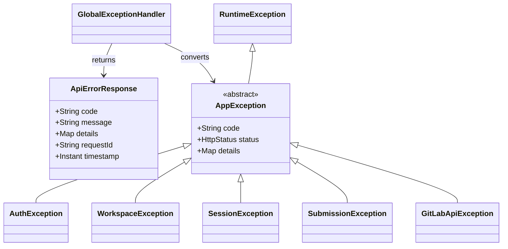
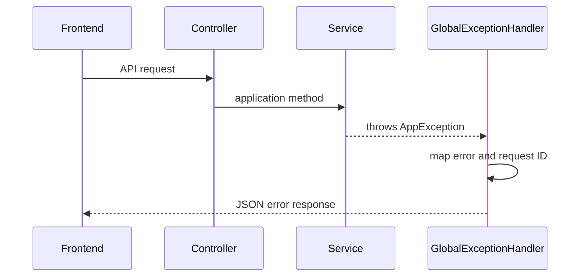

# API 공통 오류 계약

이 문서는 모든 API 영역에서 동일한 HTTP 상태, 오류 코드와 JSON 구조를 사용하기 위한 공통 규칙입니다. API의 기계 판독 가능한 원본은 [`openapi.yaml`](openapi.yaml)입니다.

## 1. 오류 응답 한 가지 형태만 사용하기

모든 앱 API 오류는 아래 JSON 형태를 사용합니다.

```json
{
  "code": "SESSION_REVISION_CONFLICT",
  "message": "다른 사용자가 먼저 일정을 수정했습니다.",
  "details": {
    "expectedRevision": 3,
    "actualRevision": 4
  },
  "requestId": "req_01J2ABCDEF",
  "timestamp": "2026-07-25T21:00:00+09:00"
}
```

| 필드 | 필수 | 설명 |
|---|---|---|
| `code` | 예 | 프론트엔드 분기와 테스트에서 사용하는 안정적인 문자열 |
| `message` | 예 | 사용자에게 그대로 표시해도 되는 한국어 설명 |
| `details` | 아니요 | 필드 오류, 최신 revision 등 오류 해결에 필요한 구조화 데이터 |
| `requestId` | 아니요 | 서버 로그에서 같은 요청을 찾는 추적 ID |
| `timestamp` | 예 | 서버가 오류 응답을 만든 시각 |

금지 사항:

- `message` 문자열로 프론트 로직을 분기하지 않습니다.
- stack trace, access token, OAuth code, 세션 ID를 응답에 넣지 않습니다.
- 같은 상황에서 팀원마다 다른 `code`를 만들지 않습니다.
- GitLab 원문 오류 body를 브라우저로 그대로 전달하지 않습니다.

## 2. HTTP 상태 선택 순서

1. 로그인이 필요한가? → `401`
2. 로그인은 했지만 Workspace 또는 GitLab 권한이 없는가? → `403`
3. 요청한 리소스가 없는가? → `404`
4. 이미 존재하거나 다른 수정과 충돌했는가? → `409`
5. JSON 형식은 맞지만 도메인 규칙에 어긋나는가? → `422`
6. 요청값 자체가 잘못되었는가? → `400`
7. GitLab upstream 장애인가? → `502`
8. GitLab에 네트워크로 도달할 수 없는가? → `503`
9. 그 밖의 예상하지 못한 서버 오류인가? → `500`

## 3. 오류 코드 목록

### 3.1 공통

| HTTP | Code | 발생 조건 | 프론트 처리 |
|---:|---|---|---|
| 400 | `INVALID_REQUEST` | JSON, query, 날짜 범위 또는 필드 검증 실패 | 잘못된 필드 안내 |
| 401 | `AUTH_REQUIRED` | 세션 쿠키 없음 또는 만료 | 로그인 화면 이동 |
| 404 | `RESOURCE_NOT_FOUND` | 구체 코드로 나누기 어려운 리소스 없음 | 이전 화면 또는 빈 상태 |
| 429 | `RATE_LIMITED` | 앱 자체 요청 제한 | 잠시 후 재시도 |
| 500 | `INTERNAL_SERVER_ERROR` | 예상하지 못한 오류 | 공통 오류 화면과 requestId |

### 3.2 인증·Workspace

| HTTP | Code | 발생 조건 |
|---:|---|---|
| 400 | `OAUTH_STATE_INVALID` | callback의 state 불일치 또는 만료 |
| 401 | `GITLAB_TOKEN_REFRESH_FAILED` | refresh token으로 갱신 실패 |
| 403 | `WORKSPACE_ACCESS_DENIED` | 활성 Workspace 멤버가 아님 |
| 403 | `GITLAB_PROJECT_ACCESS_DENIED` | 프로젝트 접근 권한 없음 |
| 403 | `GITLAB_WRITE_PERMISSION_REQUIRED` | 프로젝트 쓰기 권한 부족 |
| 404 | `WORKSPACE_NOT_FOUND` | Workspace UUID 없음 |
| 404 | `MEMBER_NOT_FOUND` | Workspace 멤버 없음 |
| 409 | `WORKSPACE_ALREADY_CONNECTED` | 같은 GitLab 프로젝트가 활성 Workspace에 연결됨 |
| 409 | `MEMBER_ALREADY_EXISTS` | 이미 등록된 GitLab 사용자 |
| 409 | `WORKSPACE_RESTORE_EXPIRED` | 삭제 후 7일 초과 |

### 3.3 일정·저장소

| HTTP | Code | 발생 조건 |
|---:|---|---|
| 400 | `INVALID_SESSION_FILE` | `session.yml` 문법 또는 필수 필드 오류 |
| 400 | `INVALID_DATE_RANGE` | from이 to 이후 |
| 403 | `FILE_PATH_NOT_ALLOWED` | 경로 traversal 또는 허용 범위 밖 파일 |
| 404 | `SESSION_NOT_FOUND` | 날짜의 `session.yml` 없음 |
| 404 | `REPOSITORY_FILE_NOT_FOUND` | 허용 경로지만 파일 없음 |
| 409 | `SESSION_ALREADY_EXISTS` | 같은 날짜의 활성 일정 존재 |
| 409 | `SESSION_REVISION_CONFLICT` | expected revision과 최신 revision 불일치 |
| 409 | `REPOSITORY_FILE_CONFLICT` | `last_commit_id` 불일치 |
| 413 | `REPOSITORY_FILE_TOO_LARGE` | 미리보기 1MB 초과 |
| 422 | `SECONDARY_DEADLINE_INVALID` | 2차 마감이 1차 마감보다 빠름 |

### 3.4 제출·기록

| HTTP | Code | 발생 조건 |
|---:|---|---|
| 400 | `INVALID_SUBMISSION_FILE` | 멤버 Markdown Front Matter 파싱 실패 |
| 404 | `ITEM_NOT_FOUND` | Session에 활성 item 없음 |
| 404 | `SUBMISSION_NOT_FOUND` | 제거·조회 대상 제출 없음 |
| 409 | `SUBMISSION_CONFLICT` | 멤버 파일 `last_commit_id` 불일치 |
| 422 | `SUBMISSION_TYPE_MISMATCH` | link 항목에 code 제출 등 |
| 422 | `SUBMISSION_VALUE_INVALID` | URL, 코드 길이, 필수 값 오류 |
| 422 | `COMMIT_MESSAGE_REQUIRED` | 빈 커밋 메시지 |

### 3.5 공통 GitLab 연동

| HTTP | Code | 발생 조건 |
|---:|---|---|
| 401 | `GITLAB_AUTHENTICATION_FAILED` | access token 거부 또는 만료 |
| 403 | `GITLAB_PROJECT_ACCESS_DENIED` | 프로젝트 접근 거부 |
| 404 | `GITLAB_RESOURCE_NOT_FOUND` | 프로젝트·브랜치·파일 없음 |
| 409 | `GITLAB_CONFLICT` | 브랜치 또는 리소스 충돌 |
| 429 | `GITLAB_RATE_LIMITED` | GitLab 요청 제한 |
| 502 | `GITLAB_COMMIT_REJECTED` | 빈 커밋, 경로 또는 최신 커밋 충돌 |
| 502 | `GITLAB_UPSTREAM_ERROR` | 그 밖의 GitLab 4xx·5xx |
| 503 | `GITLAB_UNREACHABLE` | DNS, timeout, connection 실패 |

## 4. 권장 클래스 구조



`AppException` 하나를 상속하도록 만들면 Controller에서 `try-catch`를 반복하지 않아도 됩니다.

```java
public abstract class AppException extends RuntimeException {
    private final String code;
    private final HttpStatus status;
    private final Map<String, Object> details;

    protected AppException(
        String code,
        String message,
        HttpStatus status,
        Map<String, Object> details
    ) {
        super(message);
        this.code = code;
        this.status = status;
        this.details = Map.copyOf(details);
    }

    public String code() {
        return code;
    }

    public HttpStatus status() {
        return status;
    }

    public Map<String, Object> details() {
        return details;
    }
}
```

기능 예외는 의미 있는 factory method를 제공합니다.

```java
public final class SessionException extends AppException {
    private SessionException(
        String code,
        String message,
        HttpStatus status,
        Map<String, Object> details
    ) {
        super(code, message, status, details);
    }

    public static SessionException revisionConflict(int expected, int actual) {
        return new SessionException(
            "SESSION_REVISION_CONFLICT",
            "다른 사용자가 먼저 일정을 수정했습니다.",
            HttpStatus.CONFLICT,
            Map.of("expectedRevision", expected, "actualRevision", actual)
        );
    }
}
```

## 5. Controller Advice 처리 흐름



Controller는 예외를 잡지 않습니다.

```java
@PutMapping("/{date}")
public SessionResponse update(
    @PathVariable UUID workspaceId,
    @PathVariable LocalDate date,
    @Valid @RequestBody UpdateSessionRequest request
) {
    return sessionService.update(workspaceId, date, request);
}
```

예외 변환은 한 곳에서 합니다.

```java
@RestControllerAdvice
public class GlobalExceptionHandler {

    @ExceptionHandler(AppException.class)
    ResponseEntity<ApiErrorResponse> handleAppException(
        AppException exception,
        HttpServletRequest request
    ) {
        String requestId = (String) request.getAttribute("requestId");
        ApiErrorResponse body = new ApiErrorResponse(
            exception.code(),
            exception.getMessage(),
            exception.details(),
            requestId,
            Instant.now()
        );
        return ResponseEntity.status(exception.status()).body(body);
    }
}
```

## 6. Bean Validation 오류

`@Valid` 오류도 `INVALID_REQUEST`로 통일합니다.

```json
{
  "code": "INVALID_REQUEST",
  "message": "요청값을 확인해 주세요.",
  "details": {
    "fields": {
      "title": "제목은 비어 있을 수 없습니다.",
      "deadline": "올바른 시각 형식이 아닙니다."
    }
  },
  "timestamp": "2026-07-25T21:00:00+09:00"
}
```

검증 메시지는 DTO에 작성합니다.

```java
public record CreateSessionRequest(
    @NotNull LocalDate date,
    @NotBlank @Size(max = 120) String title,
    @NotNull OffsetDateTime deadline,
    @Valid @Size(min = 1) List<SessionItemRequest> items
) {
}
```

## 7. GitLab 오류 변환 규칙

```text
GitLab 401 → GITLAB_AUTHENTICATION_FAILED
GitLab 403 → GITLAB_PROJECT_ACCESS_DENIED
GitLab 404 → GITLAB_RESOURCE_NOT_FOUND
GitLab 409 → GITLAB_CONFLICT
GitLab 429 → GITLAB_RATE_LIMITED
GitLab timeout → GITLAB_UNREACHABLE
```

GitLab 파일 수정 API는 여러 원인에 대해 `400`을 반환할 수 있습니다. 앱은 최신 파일을 다시 조회하고 `last_commit_id`가 달라졌다면 기능별 충돌 코드로 변환합니다.

```text
Session 수정 중 충돌 → SESSION_REVISION_CONFLICT 또는 REPOSITORY_FILE_CONFLICT
Submission 수정 중 충돌 → SUBMISSION_CONFLICT
그 밖의 commit 거부 → GITLAB_COMMIT_REJECTED
```

## 8. 프론트엔드 분기 예시

```ts
try {
  await sessionApi.update(workspaceId, date, request);
} catch (error) {
  if (!(error instanceof ApiError)) throw error;

  switch (error.code) {
    case "SESSION_REVISION_CONFLICT":
      openConflictDialog(error.details);
      break;
    case "AUTH_REQUIRED":
      router.push("/login");
      break;
    default:
      showToast(error.message);
  }
}
```

## 9. 영역별 필수 테스트

각 API 영역에는 최소한 다음 테스트를 작성합니다.

```text
성공 1개
입력 오류 1개
Workspace 접근 거부 1개
리소스 없음 1개
동시 수정 충돌 1개
GitLab upstream 오류 1개
응답에 token·stack trace가 없는지 1개
```

MockMvc 예시:

```java
mockMvc.perform(
        put("/api/v1/workspaces/{workspaceId}/sessions/{date}", workspaceId, date)
            .contentType(MediaType.APPLICATION_JSON)
            .content(requestJson)
    )
    .andExpect(status().isConflict())
    .andExpect(jsonPath("$.code").value("SESSION_REVISION_CONFLICT"))
    .andExpect(jsonPath("$.details.actualRevision").value(4))
    .andExpect(jsonPath("$.timestamp").exists())
    .andExpect(jsonPath("$.token").doesNotExist());
```

## 10. 완료 체크리스트

- [ ] OpenAPI에 사용한 오류 코드가 이 문서에 존재한다.
- [ ] 같은 상황에서 항상 같은 HTTP 상태와 code를 반환한다.
- [ ] Controller에 반복되는 `try-catch`가 없다.
- [ ] Bean Validation 오류가 필드별로 반환된다.
- [ ] GitLab 원문 body와 token을 응답 또는 로그에 남기지 않는다.
- [ ] 충돌 응답에 새로고침에 필요한 최신값이 있다.
- [ ] 프론트가 `message`가 아니라 `code`로 분기한다.
- [ ] MockMvc 오류 계약 테스트가 통과한다.
