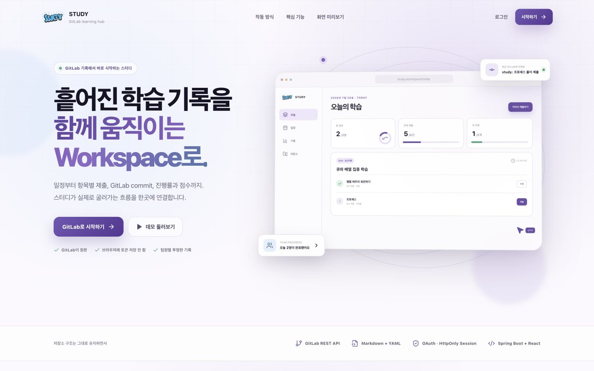
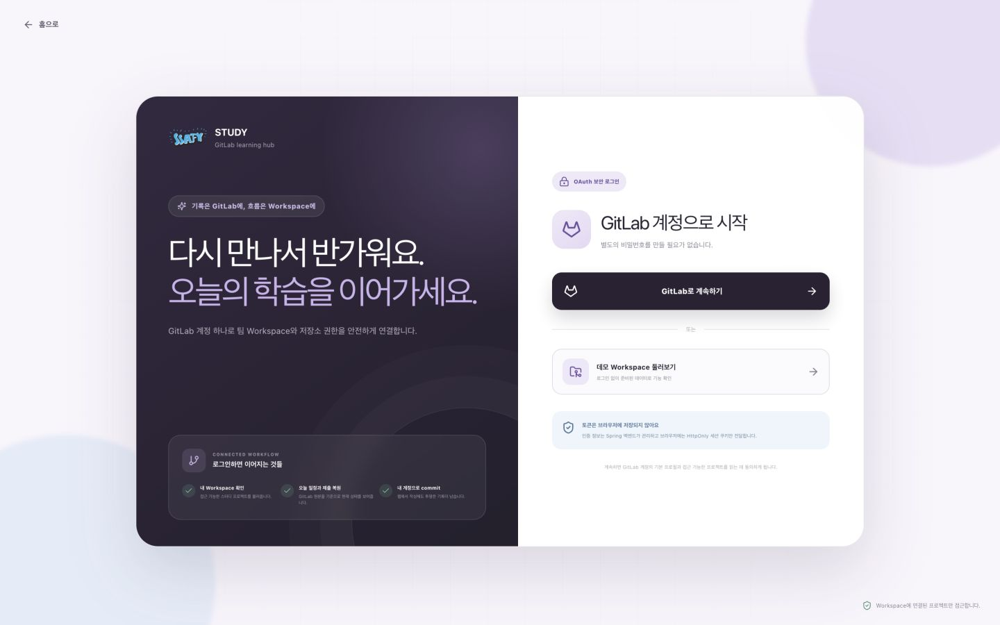
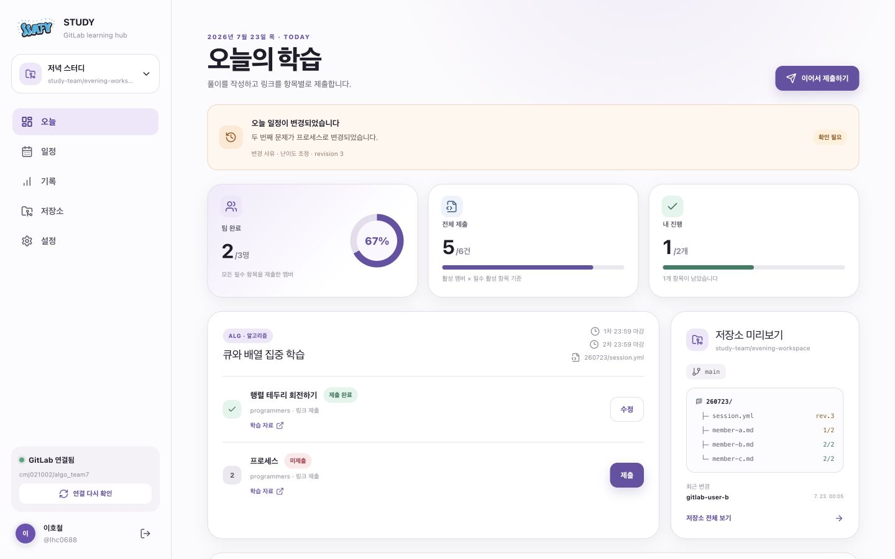
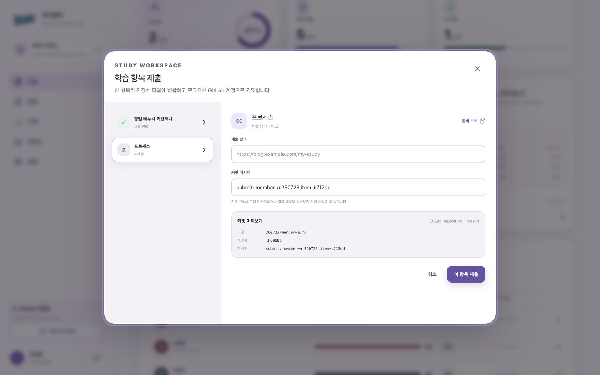
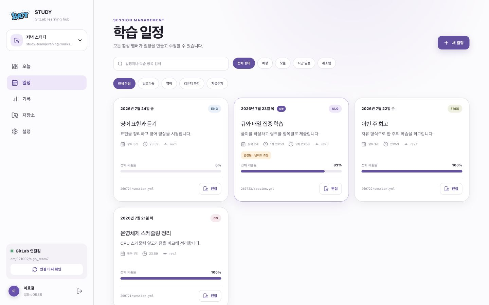
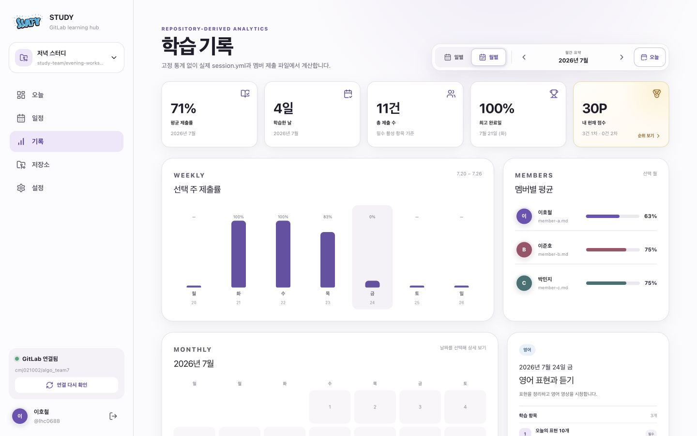
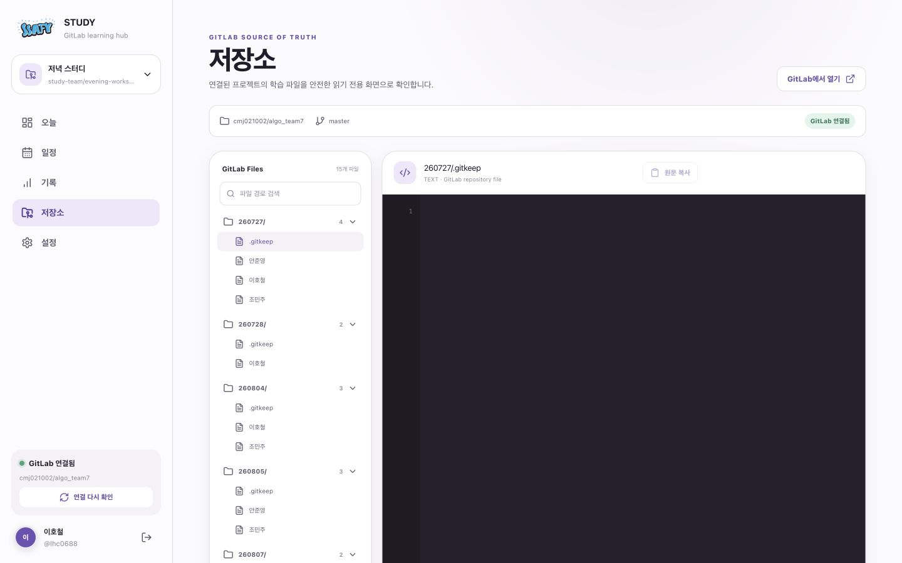
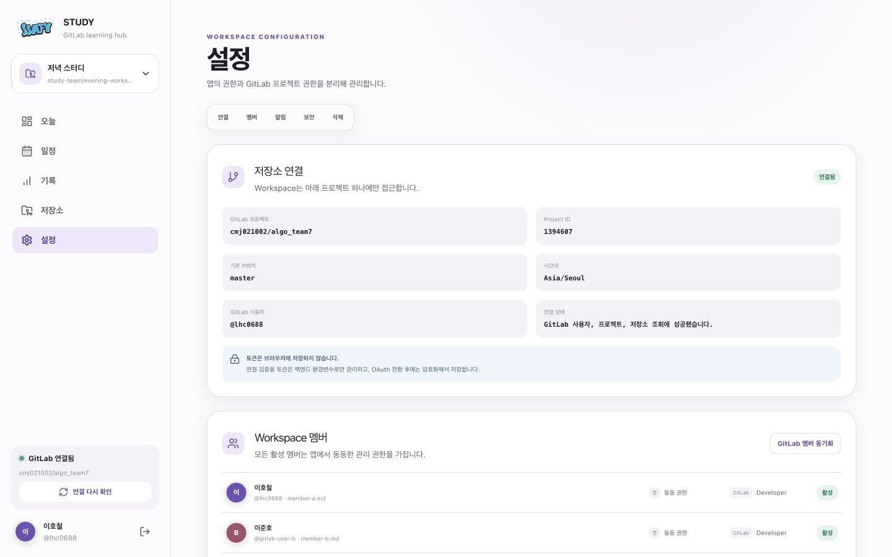
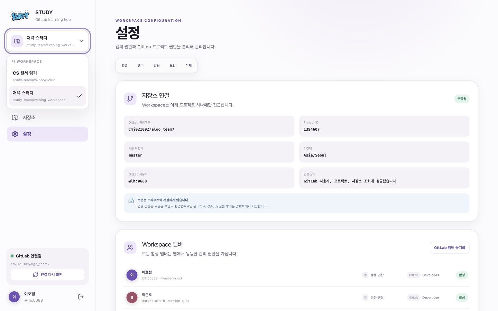
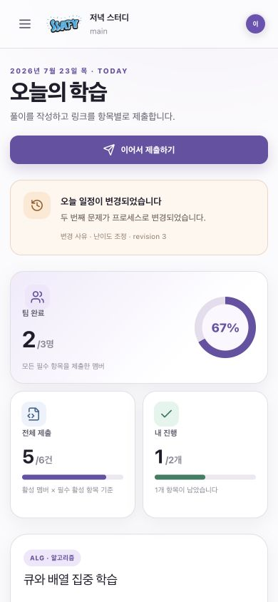

# Study Workspace 프로덕션 준비도 감사

- 감사일: 2026-08-09
- 범위: 랜딩 → OAuth 로그인 → Workspace 선택/연결 → 오늘/일정/제출 → 기록 → 저장소 → 설정/삭제
- 기준: 실제 다중 사용자 배포, GitLab OAuth 기반 권한, GitLab 저장소 원본, 장애·보안·운영 가능성
- 증거: 현재 실행 화면 10장, 프론트엔드/백엔드 코드, OpenAPI, 역할 문서, 배포·테스트 구성

## 1. 결론

현재 구현은 **완성도 높은 데모 UI + 로컬 도메인 프로토타입 + OAuth/PAT 연결 스파이크**다. 실제 사용자가 처음 로그인해 자신의 GitLab 프로젝트를 선택하고, Workspace를 만들고, OAuth 권한으로 저장소를 읽고 쓰는 프로덕션 파이프라인은 아직 연결되지 않았다.

출시 판정: **NO-GO**

가장 큰 이유는 다음과 같다.

1. 비로그인 요청이 모든 Workspace와 GitLab PAT 진단 API를 조회·변경할 수 있다.
2. OAuth 토큰은 사용자 조회에만 쓰이고 Repository API는 서버 공용 PAT를 쓴다.
3. 선택한 Workspace와 실제 GitLab 프로젝트가 서로 다르다.
4. 일정·제출·기록은 GitLab이 아니라 서버 로컬 JSON과 프론트 계산 결과다.
5. 현재 사용자는 프론트·백엔드 모두 `member-a`로 고정돼 있다.
6. PostgreSQL, Redis Session, 토큰 암호화, CSRF, 배포용 백엔드 이미지와 운영 관측이 없다.
7. 백엔드 오류 시 프론트가 조용히 seed 데이터로 전환되어 사용자가 실제 저장으로 오인할 수 있다.

## 2. 화면 기반 사용자 흐름 감사

### Step 1 — 랜딩: 시각적으로 건강 / 제품 약속은 현재 구현보다 앞섬

- 강점: 가치 제안, 주요 CTA, GitLab 원본·보안 원칙이 명확하다.
- 위험: `GitLab이 원본`, `사용자 계정 commit`, `연결된 프로젝트만 접근` 문구가 현재 실제 동작과 다르다.
- 조치: 프로덕션 연결 전까지 데모임을 명시하거나, P0 연동이 끝난 뒤 현재 카피를 유지한다.

### Step 2 — 로그인: UI 건강 / 가입과 연결 온보딩 부재

- 강점: OAuth 방식과 토큰 보관 원칙을 쉽게 설명한다.
- 위험: 로그인 성공 후 곧바로 `/today`로 이동한다. 신규 사용자의 프로젝트 선택, 권한 확인, Workspace 생성, 기존 저장소 가져오기 단계가 없다.
- 위험: 약관·개인정보 처리방침·계정 삭제/연결 해제 안내가 없다.
- 필요한 흐름: OAuth callback → 사용자 upsert → 신규/기존 사용자 분기 → 프로젝트 선택 → Workspace 구성 → 초기 동기화 → 앱 진입.

### Step 3 — 오늘: UI 건강 / 인증·데이터 격리 치명적

- 강점: 다음 행동, 팀/개인 진행률, 변경 사유, 제출 CTA가 잘 연결된다.
- 확인 결과: 쿠키 없는 요청에서 `/auth/me`는 401이지만 `/workspaces`와 개별 Workspace는 200이다.
- 위험: 새 브라우저 세션에서도 멤버 이름, 제출 상태, 일정이 보인다.
- 위험: 화면 Workspace는 `study-team/evening-workspace`인데 좌측 연결 상태는 공용 PAT 프로젝트 `cmj021002/algo_team7`이다.
- 조치: 모든 앱 라우트와 API에 인증 및 Workspace 멤버십 검증을 적용한다.

### Step 4 — 제출: UI 건강 / 실제 GitLab commit 아님

- 강점: 항목, 제출 형식, 대상 파일, 작성자, 커밋 메시지를 저장 전에 보여준다.
- 강점: modal focus trap, Escape, label, alert 등 기본 접근성 처리가 있다.
- 위험: 백엔드는 로컬 JSON을 수정하고 `local-...` 가짜 commit ID를 생성한다.
- 위험: 세션의 OAuth token, GitLab `last_commit_id`, 실제 파일 create/update가 연결되지 않는다.
- 필요한 UI: 저장 중 단계, 실제 commit 성공 링크, 401/403/409/429 복구, 권한 재연결, 충돌 비교·재시도.

### Step 5 — 일정: UI 건강 / GitLab session.yml 미연동

- 강점: 검색·상태·유형 필터, revision, 변경 사유, 1·2차 마감 모델이 잘 표현된다.
- 위험: 일정 생성·수정은 로컬 상태를 변경하며 실제 `session.yml`을 읽거나 쓰지 않는다.
- 위험: `last_commit_id` 충돌 검증, YAML 파싱/직렬화, 외부 GitLab 변경 감지가 없다.
- 필요한 UI: 저장소 스키마 오류, 외부 변경 감지, 최신 버전 다시 불러오기, 충돌 해결, import 상태.

### Step 6 — 기록: 시각적으로 건강 / 원본 기반 분석 아님

- 강점: 일별·월별 탐색, 점수·제출률·멤버 비교가 이해하기 쉽다.
- 위험: 프론트가 전체 Workspace 객체에서 계산한다. dashboard/records/scores API는 프론트에서 사용하지 않는다.
- 위험: GitLab 파일 장애·부분 파싱 실패·캐시 시점이 분석 결과에 표시되지 않는다.
- 필요한 UI: 집계 기준 시점, 마지막 동기화, 부분 실패/제외 파일, 다시 계산, 데이터 품질 경고.

### Step 7 — 저장소: 실제 GitLab 읽기 일부 완료 / Workspace 경계 불일치

- 강점: 실제 PAT 프로젝트 tree와 파일 조회, 검색, Markdown/YAML 미리보기 기반이 있다.
- 위험: 선택 Workspace가 아닌 환경변수의 단일 프로젝트를 모든 사용자에게 보여준다.
- 위험: OAuth가 아니라 `PRIVATE-TOKEN` 헤더를 사용한다.
- 위험: 기본 선택이 빈 `.gitkeep`이라 첫 화면이 검은 빈 코드 영역으로 보인다.
- 조치: WorkspaceContext의 project ID/ref + 현재 사용자의 OAuth Bearer token으로 교체한다.

### Step 8 — 설정: 구조는 건강 / 실제 관리 기능과 설명 불일치

- 강점: 연결, 멤버, 알림, 보안, 삭제 정보 구조가 명확하다.
- 위험: 연결 카드는 선택 Workspace가 아니라 공용 PAT 프로젝트를 보여준다.
- 위험: 멤버 동기화 API는 GitLab을 호출하지 않고 timestamp만 바꾼다.
- 위험: 알림은 토글 저장만 있고 실제 알림 채널/전송/수신함이 없다.
- 위험: 소프트 삭제는 상태 문자열만 변경한다. 7일 만료, 복원 UI, 정리 job이 없다.
- 제품 결정 필요: 모두 동등 권한이어도 프로젝트 재연결·멤버 제거·Workspace 삭제는 Owner/Manager 권한을 두는 편이 안전하다.

### Step 9 — Workspace 전환: UI 부분 완료 / 생성·연결·빈 상태 없음

- 강점: 여러 Workspace를 전환하는 인터랙션과 키보드 focus 표현이 있다.
- 위험: 준비된 두 Workspace만 표시하며 `새 Workspace`, `GitLab 프로젝트 연결`, `초대받은 Workspace`, `삭제된 Workspace 복원` 진입점이 없다.
- 위험: 현재 선택이 URL이나 서버 사용자 설정에 보존되지 않는다.

### Step 10 — 모바일: 시각적으로 건강 / 동일한 인증 문제 존재

- 강점: 핵심 CTA와 진행 지표가 390px에서 자연스럽게 재배치된다.
- 위험: 모바일에서도 비로그인 데이터 접근과 실제/데모 혼동은 동일하다.
- 접근성 위험: 작은 보조 텍스트와 옅은 회색의 대비는 수치 검증이 필요하다. 모바일 멤버 표에서 시각적으로 숨긴 헤더와 셀의 연관성도 스크린리더 테스트가 필요하다.

### 캡처하지 못한 단계 — 실제 GitLab 동의·callback

- 로컬 감사 브라우저는 GitLab 로그인 세션을 사용하지 않았으므로 실제 사용자 동의 화면과 callback 성공 후 첫 진입을 캡처하지 않았다.
- OAuth 서비스의 state, code 교환, 사용자 조회 코드는 있으나 실제 배포 도메인·HTTPS·다중 인스턴스 조건의 E2E 증거는 없다.

## 3. 구현 상태 매트릭스

| 영역 | 판정 | 현재 구현 | 프로덕션에 필요한 것 |
|---|---|---|---|
| 랜딩/로그인 UI | 완료(데모 범위) | 반응형, OAuth CTA, 오류 문구 | 약관·개인정보·신규 사용자 분기 |
| 앱 Shell/모바일 | 완료(데모 범위) | 내비게이션, Workspace picker, toast, modal | auth gate, empty/loading/error bootstrap |
| OAuth authorize/state/code | 부분 완료 | state, callback, token 교환, user 조회 | callback 통합 테스트, PKCE 검토, 배포 HTTPS |
| OAuth refresh/revoke | 부분 완료 | 메모리 세션에서 refresh/revoke | 회전 token 저장, 실패 복구, 재인증 UX |
| 사용자 계정 | 미구현 | GitLab user를 데모 `member-a`에 덮어씀 | User upsert, 상태, 약관, 탈퇴, 연결 해제 |
| API 인증 | 미구현 | `/auth/me`만 401 | 전체 보호 API 인증, 401 공통 처리 |
| Workspace 권한 | 미구현 | ID만 알면 모두 접근 | 멤버십/역할/상태별 403, 객체 단위 검증 |
| GitLab 프로젝트 검색 | 스텁 | PAT 고정 프로젝트 1개 반환 | OAuth `/projects`, 검색·페이지·권한 표시 |
| Workspace 생성 | 부분 스텁 | 로컬 JSON 생성 API | 프론트 wizard, 중복/권한/스키마 검증 |
| Workspace 목록 | 부분 스텁 | 전역 Workspace 전체 반환 | 로그인 사용자에게 속한 목록만 반환 |
| 멤버 관리 | 스텁 | 로컬 add/deactivate, 후보는 빈 배열 | GitLab 멤버 조회, 매핑, 접근 상실, 초대 |
| 동기화 | 미구현 | timestamp 갱신 | tree/YAML/Markdown 읽기, diff, job 상태 |
| 일정 CRUD | 완료(로컬 모델) | revision·validation·로컬 JSON | YAML codec + GitLab create/update + commit 충돌 |
| 제출 CRUD | 완료(로컬 모델) | 타입·항목 병합·점수 입력 | OAuth 파일 create/update, 실제 commit, retry |
| Dashboard/기록/점수 | 완료(로컬 모델) | 로컬 상태 기반 계산 | GitLab 원본 파싱, 캐시, 부분 실패 정책 |
| 저장소 읽기 | 부분 완료 | PAT 고정 프로젝트 tree/file | Workspace별 OAuth token/ref/path 정책 |
| 저장소 쓰기 | 스파이크 완료 | PAT client와 opt-in 테스트 | Workspace 서비스에 실제 연결, OAuth 전환 |
| 알림 | 미구현 | 설정 토글만 존재 | 인앱/이메일/웹훅 중 채널, event와 delivery |
| 삭제/복원 | 부분 스텁 | status 변경 | deletedAt, 7일 정책, 복원 UI, 정리 job |
| 영속화 | 데모 완료 | 원자적 로컬 JSON 파일 | PostgreSQL schema/Flyway, 백업, migration |
| 분산 세션 | 미구현 | JVM HttpSession | Redis/Spring Session 또는 sticky 전략 |
| 토큰 보안 | 미구현 | 세션 객체에 평문 token | 암호화 저장/KMS, key rotation, 로그 차단 |
| CSRF/보안 필터 | 미구현 | CORS + SameSite cookie | Spring Security, CSRF, rate limit, headers |
| 프론트 장애 처리 | 부분 | 일부 modal/repo 오류 | 401 redirect, 403/409/429 전용 UX, retry |
| 배포 | 프론트 기반만 있음 | Sites/Worker 설정 | 백엔드 이미지·호스팅·DB·Redis·도메인·TLS |
| 테스트 | 기본 단위만 있음 | build/lint, 4 SSR, 소수 service/client test | controller/security/E2E/multi-user/concurrency/a11y |
| 문서 계약 | 불일치 | 목표 문서는 상세함 | OpenAPI와 코드 status/shape 동기화, 현재/목표 분리 |

## 4. 실제 사용자 가입·연결 파이프라인 제안

### 신규 사용자

1. 랜딩에서 GitLab 로그인 선택
2. OAuth 동의 및 callback
3. 서버가 GitLab user ID 기준으로 User upsert
4. 약관·개인정보 동의 및 기본 프로필 확인
5. OAuth token으로 접근 가능한 프로젝트 검색
6. 프로젝트 선택 후 권한·기본 브랜치·보호 브랜치 검사
7. `기존 Study Workspace 가져오기` 또는 `새 구조 초기화` 선택
8. 저장소 스키마 스캔: 날짜 폴더, `session.yml`, 멤버 Markdown, 충돌 파일 표시
9. Workspace 이름·timezone·멤버 파일 매핑 확인
10. Workspace 생성 트랜잭션 및 초기 sync job 실행
11. 성공/부분 성공/실패 결과와 GitLab 링크 표시
12. 빈 Today 화면 또는 가져온 데이터로 진입

### 재방문 사용자

1. `/auth/me`로 세션 확인
2. 마지막 Workspace 또는 Workspace 선택 화면 로드
3. token 만료 시 서버 refresh
4. 접근 권한 상실·프로젝트 삭제·scope revoke를 감지해 reconnect UX 제공
5. 마지막 sync 이후 외부 GitLab 변경을 확인하고 앱 진입

### 제출 사용자

1. 현재 사용자와 Workspace 멤버십 검증
2. 서버가 project/ref/본인 파일 경로를 결정
3. 최신 session과 제출 파일을 OAuth Bearer token으로 조회
4. revision·last commit 검증 후 한 항목만 병합
5. GitLab create/update 성공 뒤 DB cache/event 갱신
6. commit SHA·GitLab 링크를 사용자에게 영수증처럼 표시
7. 충돌이면 최신/내 변경 비교와 재적용 선택 제공

## 5. 추가해야 할 프론트엔드

### P0 — 실제 흐름에 필수

- 앱 진입 auth gate와 세션 확인 화면
- 401 자동 로그인 이동, 403 권한 없음, 409 충돌, 429 대기 안내
- 첫 로그인 온보딩 wizard
- OAuth 프로젝트 검색/페이지네이션/권한 배지
- 프로젝트 연결 검사 및 기본·보호 브랜치 결과
- 기존 저장소 import vs 새 Workspace 초기화
- 초기 sync 진행률과 실패 파일 목록
- Workspace 0개 empty state와 `새 Workspace` CTA
- Demo 전용 배지·격리된 데이터·명확한 `데모 종료`
- 실제 commit 성공 SHA/링크와 재시도
- OAuth 만료/취소/권한 철회 reconnect 화면

### P1 — 운영에 필요한 관리 UI

- Owner/Manager/Member 역할과 위험 작업 권한
- GitLab 멤버 후보·파일명 매핑·중복 해결
- 멤버 접근 권한 상실/복구 상태
- Workspace 연결 변경 및 프로젝트 재검증
- 삭제된 Workspace 목록과 7일 복원
- 계정/연결 앱/로그아웃/탈퇴/데이터 처리 안내
- 동기화 센터: 마지막 성공, 실패, 외부 변경, 수동 재동기화
- 알림 수신함 또는 실제 채널 설정

### P2 — 품질 향상

- skeleton/empty/offline/maintenance 상태
- 접근성 대비 측정, 모바일 표 헤더, 폼 오류 요약
- 브라우저 confirm/alert를 일관된 modal로 교체
- onboarding과 제출 funnel 계측
- 실제 날짜와 Workspace timezone 적용

## 6. 추가·변경해야 할 백엔드와 API

### 인증·사용자

- `User`, `OAuthCredential`, `TermsAcceptance` 영속 모델
- OAuth callback에서 사용자 upsert; 데모 `member-a` 덮어쓰기 제거
- `GitLabTokenProvider.getValidAccessToken(userId)` 구현
- refresh token rotation, 암호화 저장, revoke/reconnect 처리
- Spring Security 기반 인증, CSRF, security headers, rate limiting

### GitLab·Workspace

- `GET /gitlab/projects`를 사용자 OAuth token 기반으로 구현
- project connection-check에서 membership/access level/default/protected branch 검사
- `GET /workspaces`를 현재 사용자 기준으로 필터
- 모든 `{workspaceId}` API에 `WorkspaceAccessService.requireActiveMember`
- Workspace 생성 시 프로젝트 중복 연결과 idempotency 처리
- GitLab 프로젝트 멤버 조회·동기화·접근 상실 반영
- 현재 Workspace와 PAT 전역 connection endpoint 분리/제거

### 일정·제출·저장소

- GitLab YAML/Markdown parser와 serializer
- Workspace project ID/ref로 RepositoryPort 호출
- `Authorization: Bearer <OAuth token>` 방식으로 전환
- create/update에 `last_commit_id` 적용
- 외부 변경, 404 create, 409 conflict, 429 Retry-After 처리
- sync job, cache invalidation, 부분 파싱 실패 정책
- 현재 로컬 repository tree/file 합성 API를 실제 GitLab adapter로 교체

### 데이터

- PostgreSQL: users, oauth_credentials, workspaces, workspace_members, sync_jobs, notification_preferences, audit_events
- GitLab에 남아야 할 session/제출 본문은 DB에 이중 저장하지 않고 cache/metadata만 저장
- Flyway migration, transaction, unique constraint, optimistic locking
- Redis/Spring Session 또는 단일 세션 전략
- token encryption key를 KMS/secret manager에서 관리

## 7. 배포·운영 파이프라인

현재 프론트 배포 설정은 있으나 백엔드 배포 경로는 없다. 권장 순서는 다음과 같다.

1. 프론트와 API의 public URL 결정. 가능하면 같은 site의 `/api` reverse proxy로 cookie/CORS 복잡도를 줄인다.
2. GitLab Application callback을 `https://<api-domain>/api/v1/auth/gitlab/callback`으로 교체한다.
3. 백엔드 Dockerfile, production profile, 환경변수 validation을 만든다.
4. PostgreSQL/Redis managed service와 migration job을 연결한다.
5. `Secure` cookie, 신뢰 proxy, CORS allowlist, CSRF를 배포 환경에서 강제한다.
6. secret manager에 OAuth secret, token encryption key, DB/Redis credential을 보관한다.
7. readiness/liveness를 DB·Redis 의존성과 분리하고 metrics/log tracing을 붙인다.
8. backup/restore, audit log, GitLab rate-limit/timeout alert를 구성한다.
9. staging GitLab OAuth Application과 테스트 프로젝트에서 E2E를 통과시킨다.
10. production smoke test 후 점진적으로 사용자에게 연다.

## 8. 테스트 출시 게이트

- 비로그인 API가 모두 401인지
- 다른 Workspace ID로 접근하면 403인지
- 사용자 A가 사용자 B 제출 파일을 변경할 수 없는지
- OAuth refresh/revoke/재동의가 동작하는지
- 프로젝트 Developer/Reporter/보호 브랜치 조합별 결과가 맞는지
- GitLab 외부 변경과 같은 item 동시 변경이 409인지
- 파일 create/update와 commit SHA가 실제 저장소에 남는지
- 서버 재시작/다중 인스턴스에서도 세션이 유지되는지
- DB migration rollback/backup restore가 가능한지
- 429/5xx/timeout에서 사용자에게 거짓 성공을 표시하지 않는지
- keyboard-only, screen reader, 200% zoom, 대비 검사 통과 여부
- 가입→프로젝트 연결→첫 제출→commit 확인 E2E 성공 여부

## 9. 이미 재사용 가능한 완료 영역

- 랜딩·로그인·앱 Shell·모바일 반응형 시각 체계
- 오늘/일정/제출/기록/저장소/설정 화면 정보 구조
- modal focus 관리, 기본 ARIA label, toast live status, reduced-motion CSS
- 일정 revision, 변경 사유, 제출 타입, 점수 규칙의 로컬 도메인 모델
- OAuth state, code 교환, GitLab user 조회, refresh/revoke 서비스 골격
- PAT 기반 GitLab tree/file/read-write spike와 path 검증
- 로컬 상태 원자적 파일 저장과 기본 단위 테스트
- build, lint, OpenAPI validation, secret 검사 자동화

이 영역은 버릴 필요가 없고, 인증된 사용자 컨텍스트와 실제 GitLab adapter 뒤에 연결하면 된다.

## 10. 권장 구현 순서

### Milestone A — 보안 경계

- Spring Security, auth gate, current user, Workspace membership
- demo와 production data path 완전 분리
- 고정 `member-a` 제거

### Milestone B — OAuth Repository

- token provider, OAuth Bearer GitLab client
- 프로젝트 검색·검사·WorkspaceContext
- PAT 전역 경로 제거

### Milestone C — 온보딩

- 프로젝트 선택, import/init, 멤버 매핑, initial sync UI/API
- Workspace empty/create/switch persistence

### Milestone D — GitLab 원본 세로 기능

- session.yml CRUD
- 멤버 Markdown 제출 CRUD
- Dashboard/records/scores 원본 계산
- conflict/retry UX

### Milestone E — 운영 배포

- PostgreSQL, Redis Session, token encryption, migration
- backend hosting, domain/TLS, observability, backup
- 보안·E2E·접근성 출시 게이트

## 11. 증거 한계

- 실제 GitLab 동의 화면과 production callback은 이번 감사에서 캡처하지 않았다.
- 스크린샷만으로 색 대비 수치, 스크린리더 발화, 전체 키보드 순서, WCAG 준수를 확정할 수 없다.
- 실제 GitLab write spike는 opt-in 테스트이므로 이번 감사에서 외부 저장소를 변경하지 않았다.
