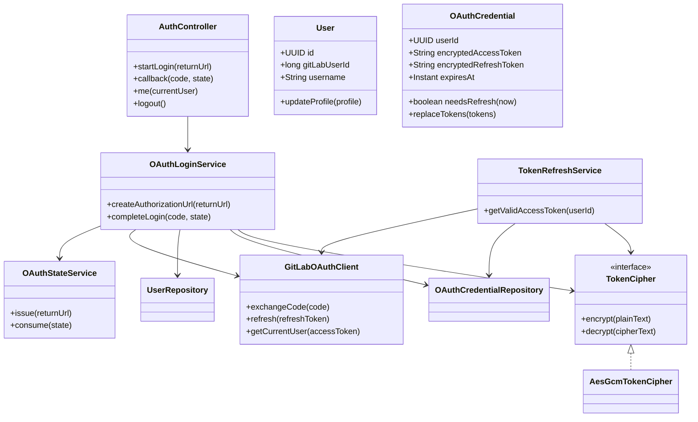
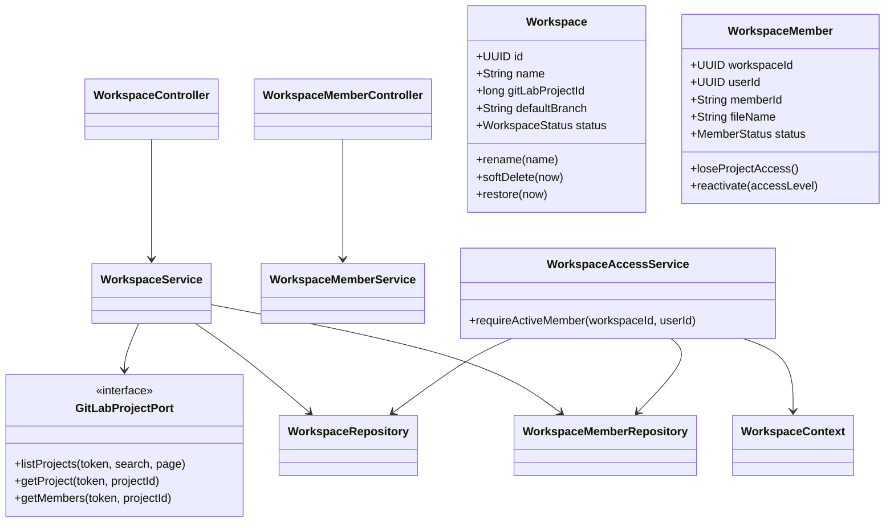
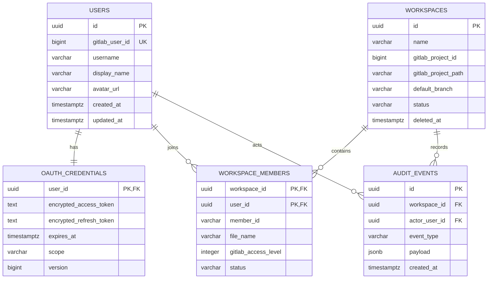
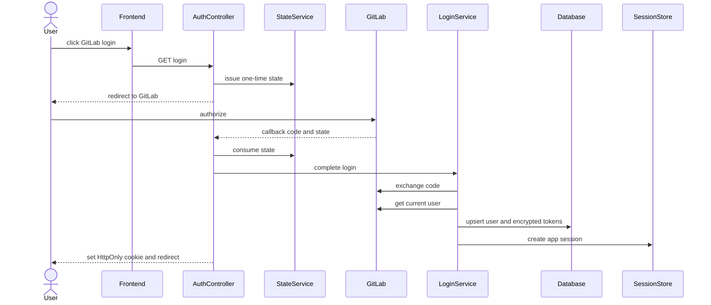
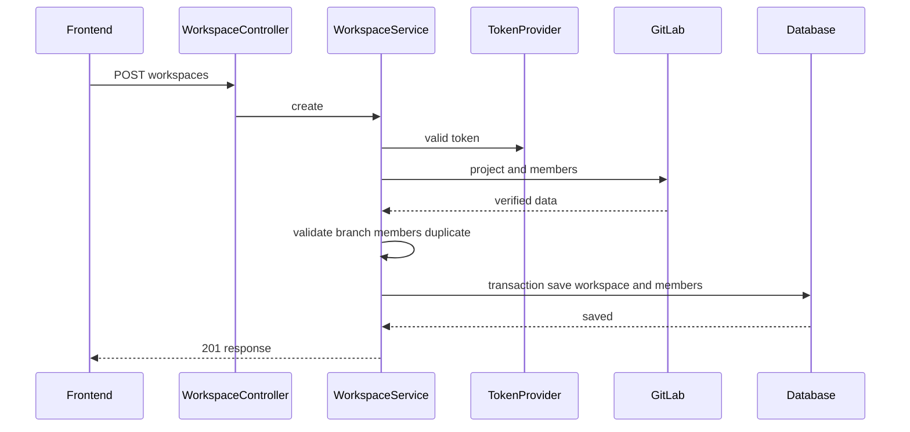

# 팀원 1 초심자 구현 핸드북 — 인증·Workspace

이 문서는 Spring Security, OAuth, JPA가 처음이어도 작은 단계로 구현할 수 있도록 만든 작업 설명서입니다.

함께 열어둘 문서:

- [역할 요구사항](../backend-role-1-auth-workspace.md)
- [OpenAPI 계약](../openapi.yaml)
- [공통 오류 계약](../api-error-catalog.md)
- [로컬 개발환경](../development-environment.md)

## 1. PM 인수인계

### 사용자 문제

사용자는 GitLab 계정으로 로그인하고 자신이 실제로 접근할 수 있는 프로젝트만 Workspace로 연결해야 합니다. 브라우저는 GitLab token을 몰라야 하며, 다른 모든 백엔드 기능은 “현재 사용자”와 “이 Workspace의 활성 멤버인가”를 안전하게 확인할 수 있어야 합니다.

### 완성된 사용자 흐름

1. 사용자가 GitLab 로그인을 누릅니다.
2. GitLab에서 앱 사용에 동의합니다.
3. 앱으로 돌아오면 사용자 정보와 Workspace 목록이 보입니다.
4. 접근 가능한 프로젝트를 검색합니다.
5. 프로젝트 연결 가능 여부와 쓰기 권한을 확인합니다.
6. 프로젝트 멤버 중 함께할 사용자를 선택합니다.
7. Workspace를 생성합니다.
8. 일정·제출 API가 같은 로그인 세션과 Workspace 권한 검사를 사용합니다.
9. GitLab 권한을 잃은 멤버는 과거 기록을 유지하지만 새 쓰기는 차단됩니다.

### 인수 조건

| 조건 | 검증 |
|---|---|
| 비로그인 보호 API는 `401 AUTH_REQUIRED` | MockMvc |
| OAuth state 불일치·만료·재사용 차단 | 단위 테스트 |
| token 원문이 DB·로그·응답에 없음 | DB·로그 검사 |
| `/auth/me`가 사용자와 Workspace 반환 | API 테스트 |
| 프로젝트 목록은 로그인 사용자의 token 사용 | GitLab Mock |
| 활성 Workspace의 프로젝트 중복 연결 차단 | DB 제약·서비스 테스트 |
| 공통 `WorkspaceAccessService`가 비멤버 차단 | 계약 테스트 |
| 소프트 삭제 후 7일 안에만 복원 | Clock 기반 테스트 |

### 담당하지 않는 것

- `session.yml` 생성·수정: 팀원 2
- 멤버 Markdown 병합·점수: 팀원 3
- 화면 디자인 변경
- 기능별 GitLab commit message 결정

## 2. 먼저 이해할 용어

- 인증: 사용자가 누구인지 확인
- 인가: 특정 Workspace에서 행동할 수 있는지 확인
- OAuth code: token으로 교환하는 짧고 일회성인 값
- 앱 세션: 브라우저가 Study-ing에 로그인했음을 증명
- GitLab token: 백엔드가 사용자를 대신해 GitLab API를 호출할 때 사용
- HttpOnly cookie: JavaScript에서 읽지 못하는 쿠키
- 낙관적 잠금: version이 같을 때만 수정해 동시 덮어쓰기를 방지

앱 세션 쿠키 안에 GitLab token을 넣지 않습니다.

## 3. 추가할 의존성

구현 단계에 맞춰 `backend/build.gradle`에 추가합니다.

```gradle
implementation 'org.springframework.boot:spring-boot-starter-security'
implementation 'org.springframework.boot:spring-boot-starter-oauth2-client'
implementation 'org.springframework.boot:spring-boot-starter-data-jpa'
implementation 'org.springframework.boot:spring-boot-starter-data-redis'
implementation 'org.springframework.session:spring-session-data-redis'
implementation 'org.flywaydb:flyway-core'
runtimeOnly 'org.postgresql:postgresql'

testRuntimeOnly 'com.h2database:h2'
testImplementation 'org.springframework.security:spring-security-test'
```

추가 직후:

```bash
cd backend
./gradlew test
```

Security 추가 후 기존 API가 모두 `401`이 되면 `SecurityConfig`의 공개 경로를 먼저 설정합니다.

## 4. 최종 패키지 구조

```text
com.studyworkspace/
├── auth/
│   ├── controller/AuthController.java
│   ├── dto/CurrentUserResponse.java
│   ├── service/OAuthLoginService.java
│   ├── service/OAuthStateService.java
│   ├── service/TokenRefreshService.java
│   ├── service/CurrentUserService.java
│   ├── domain/User.java
│   ├── domain/OAuthCredential.java
│   ├── infrastructure/GitLabOAuthClient.java
│   ├── infrastructure/UserJpaRepository.java
│   └── infrastructure/OAuthCredentialJpaRepository.java
├── workspace/
│   ├── controller/WorkspaceController.java
│   ├── controller/WorkspaceMemberController.java
│   ├── dto/CreateWorkspaceRequest.java
│   ├── dto/WorkspaceResponse.java
│   ├── service/WorkspaceService.java
│   ├── service/WorkspaceMemberService.java
│   ├── service/WorkspaceAccessService.java
│   ├── domain/Workspace.java
│   ├── domain/WorkspaceMember.java
│   ├── infrastructure/WorkspaceJpaRepository.java
│   └── infrastructure/WorkspaceMemberJpaRepository.java
└── security/
    ├── CurrentUser.java
    ├── CurrentUserArgumentResolver.java
    ├── SecurityConfig.java
    ├── TokenCipher.java
    ├── AesGcmTokenCipher.java
    └── RequestIdFilter.java
```

빈 파일을 한꺼번에 만들지 말고 각 단계에 필요한 파일만 추가합니다.

## 5. UML 클래스 다이어그램

### 인증



### Workspace



## 6. DB ERD



필수 제약:

```sql
create unique index uk_users_gitlab_user_id
    on users (gitlab_user_id);

create unique index uk_active_workspace_project
    on workspaces (gitlab_project_id)
    where status = 'ACTIVE';

create unique index uk_workspace_member_id
    on workspace_members (workspace_id, member_id);

create unique index uk_workspace_file_name
    on workspace_members (workspace_id, file_name);
```

## 7. 모델 필드 규칙

### User

| 필드 | 규칙 |
|---|---|
| `id` | 앱 내부 UUID |
| `gitLabUserId` | 변경되지 않는 GitLab 숫자 ID, unique |
| `username` | 변경 가능, 식별자로 사용 금지 |
| `displayName`, `avatarUrl` | 로그인 시 최신 profile로 갱신 |

### OAuthCredential

| 필드 | 규칙 |
|---|---|
| access·refresh token | AES-GCM 암호화 후 저장 |
| `expiresAt` | access token 만료 시각 |
| `scope` | 필요한 scope 검증 |
| `version` | 동시 refresh 충돌 방지 |

### Workspace

| 필드 | 규칙 |
|---|---|
| `gitLabProjectId` | GitLab 숫자 ID |
| `gitLabProjectPath` | 표시·감사용 |
| `defaultBranch` | 프로젝트 API로 검증한 값 |
| `status` | `ACTIVE`, `SOFT_DELETED` |
| `deletedAt` | 7일 복구 기한 계산 |

### WorkspaceMember

| 필드 | 규칙 |
|---|---|
| `memberId` | 저장소에서도 쓰는 안정적 ID |
| `fileName` | `{memberId}.md`, `/`, `..` 금지 |
| `gitLabAccessLevel` | 마지막 동기화 값 |
| `status` | `ACTIVE`, `LOST_PROJECT_ACCESS`, `INACTIVE` |

## 8. OAuth 로그인 시퀀스



state 검증 전에 token 교환을 하지 않습니다.

## 9. Workspace 생성 시퀀스



GitLab 검증이 끝나기 전에 DB를 저장하지 않습니다.

## 10. 단계별 구현

### 0단계: 작업 브랜치

```bash
git switch master
git pull gitlab master
git switch -c feat/member1-auth-workspace
```

### 1단계: migration과 Entity

1. JPA, Flyway, PostgreSQL 의존성 추가
2. `V1__create_auth_workspace_tables.sql` 작성
3. `ddl-auto: validate` 설정
4. Entity 작성
5. Repository 테스트로 unique 제약 확인

```yaml
spring:
  datasource:
    url: ${DB_URL}
    username: ${DB_USERNAME}
    password: ${DB_PASSWORD}
  jpa:
    hibernate:
      ddl-auto: validate
  flyway:
    enabled: true
```

`ddl-auto: update`는 사용하지 않습니다.

### 2단계: OAuthState

```java
public final class OAuthState {
    private final String value;
    private final String returnUrl;
    private final Instant expiresAt;
    private boolean consumed;

    public void consume(Clock clock) {
        if (consumed || !clock.instant().isBefore(expiresAt)) {
            throw AuthException.invalidState();
        }
        consumed = true;
    }
}
```

체크:

- `SecureRandom`
- TTL 5~10분
- 한 번 사용 후 삭제
- `/`로 시작하는 내부 returnUrl만 허용
- `//evil.example`, `https://evil.example` 거부

### 3단계: TokenCipher

```java
public interface TokenCipher {
    String encrypt(String plainText);
    String decrypt(String encodedCipherText);
}
```

저장 형식 예:

```text
v1:base64(iv):base64(ciphertext-and-tag)
```

- 매번 새 12바이트 IV
- AES-GCM 256-bit key
- key는 `TOKEN_ENCRYPTION_KEY`
- `toString()`에 token 제외

테스트: 왕복, 같은 평문의 다른 암호문, 변조 실패, 잘못된 key 실패.

### 4단계: GitLabOAuthClient

```java
public interface GitLabOAuthPort {
    OAuthTokenSet exchangeCode(String code, String redirectUri);
    OAuthTokenSet refresh(String refreshToken);
    GitLabUserProfile getCurrentUser(String accessToken);
}
```

외부 응답 DTO, 서비스 값, JPA Entity를 분리합니다.

### 5단계: OAuthLoginService

```java
@Transactional
public LoginResult completeLogin(String code, String state) {
    OAuthStateData stateData = oauthStateService.consume(state);
    OAuthTokenSet tokens = gitLabOAuthPort.exchangeCode(code, redirectUri);
    GitLabUserProfile profile = gitLabOAuthPort.getCurrentUser(tokens.accessToken());
    User user = userRepository.upsertByGitLabUserId(profile);
    credentialRepository.save(encrypt(user.id(), tokens));
    return new LoginResult(user.id(), stateData.returnUrl());
}
```

`LoginResult`에 token을 넣지 않습니다.

### 6단계: SecurityConfig

공개 경로:

```text
GET /actuator/health
GET /api/v1/auth/gitlab/login
GET /api/v1/auth/gitlab/callback
GET /api/v1/gitlab/connection
GET /api/v1/gitlab/repository/file
```

그 밖의 기능 API는 인증이 필요합니다.

```java
public record CurrentUser(
    UUID userId,
    long gitLabUserId,
    String username
) {
}
```

Controller가 세션 ID를 직접 파싱하지 않고 `CurrentUserArgumentResolver`를 사용합니다.

### 7단계: TokenRefreshService

```text
1. credential row를 잠금과 함께 읽기
2. expiresAt이 현재보다 60초 이상 뒤면 기존 token 복호화
3. 아니면 refresh token 복호화
4. GitLab refresh 요청
5. 새 token 암호화·저장
6. access token만 공통 GitLab client에 전달
```

처음에는 DB 비관적 잠금으로 단순하게 구현합니다.

### 8단계: Workspace Domain

```java
public void softDelete(String confirmationName, Instant now) {
    if (!name.equals(confirmationName)) {
        throw WorkspaceException.confirmationMismatch();
    }
    status = WorkspaceStatus.SOFT_DELETED;
    deletedAt = now;
}

public void restore(Instant now) {
    if (deletedAt == null || deletedAt.plus(7, ChronoUnit.DAYS).isBefore(now)) {
        throw WorkspaceException.restoreExpired();
    }
    status = WorkspaceStatus.ACTIVE;
    deletedAt = null;
}
```

`Instant.now()` 대신 주입한 `Clock`을 사용합니다.

### 9단계: Workspace 생성

```text
1. 현재 사용자의 유효 token 조회
2. GitLab 프로젝트 상세 조회
3. 기본 브랜치 확인
4. 현재 사용자 access level 확인
5. 선택 ID가 프로젝트 멤버인지 확인
6. ACTIVE Workspace 중복 확인
7. 한 트랜잭션으로 Workspace와 Membership 저장
8. 감사 이벤트 저장
9. 응답 DTO 반환
```

`study.yml` 초기화는 팀원 2가 제공할 `StudyRepositoryInitializer`에 위임합니다.

### 10단계: WorkspaceAccessService

```java
public WorkspaceContext requireActiveMember(UUID workspaceId, UUID userId) {
    Workspace workspace = workspaceRepository.findById(workspaceId)
        .orElseThrow(WorkspaceException::notFound);
    workspace.requireActive();

    WorkspaceMember member = memberRepository
        .findByWorkspaceIdAndUserId(workspaceId, userId)
        .orElseThrow(WorkspaceException::accessDenied);
    member.requireWritable();

    return WorkspaceContext.from(workspace, member);
}
```

```java
public record WorkspaceContext(
    UUID workspaceId,
    long gitLabProjectId,
    String gitLabProjectPath,
    String defaultBranch,
    UUID userId,
    long gitLabUserId,
    String memberId,
    String fileName
) {
}
```

팀원 2와 3은 프론트가 보낸 project ID나 fileName을 사용하지 않고 이 Context를 사용합니다.

### 11단계: 멤버 동기화

```text
GitLab 멤버와 앱 ACTIVE 멤버 교집합 → ACTIVE, access level 갱신
앱에만 존재 → LOST_PROJECT_ACCESS
GitLab에만 존재 → new candidate
```

과거 제출을 보존하기 위해 row를 삭제하지 않습니다.

## 11. API와 클래스 매핑

| API | Controller | Service |
|---|---|---|
| OAuth login·callback | `AuthController` | `OAuthLoginService` |
| `/auth/me` | `AuthController` | `CurrentUserService` |
| `/gitlab/projects` | `GitLabProjectController` | `GitLabProjectService` |
| connection-check | `GitLabProjectController` | `ProjectConnectionService` |
| Workspace CRUD | `WorkspaceController` | `WorkspaceService` |
| 멤버 목록·추가·동기화 | `WorkspaceMemberController` | `WorkspaceMemberService` |

## 12. 테스트 표

### 단위

| 클래스 | 필수 사례 |
|---|---|
| `OAuthState` | 성공, 만료, 재사용, 외부 returnUrl |
| `AesGcmTokenCipher` | 왕복, 다른 IV, 변조, 잘못된 key |
| `OAuthCredential` | 유효, safety window, 만료 |
| `Workspace` | rename, delete, 7일 내·후 restore |
| `WorkspaceMember` | access lost, reactivate, inactive |

### Repository

- `gitlab_user_id` unique
- active project unique
- member ID와 fileName unique
- soft-deleted Workspace가 active query에서 제외
- credential version 충돌

### Service

- OAuth 성공 시 User와 Credential 동시 저장
- `/user` 실패 시 저장 없음
- Workspace GitLab 검증 실패 시 DB 저장 없음
- 프로젝트 비멤버 포함 시 전체 롤백
- Workspace 비멤버 접근 거부
- 멤버 동기화 결과 수치

### Controller

```java
@Test
void anonymousCannotReadWorkspaces() throws Exception {
    mockMvc.perform(get("/api/v1/workspaces"))
        .andExpect(status().isUnauthorized())
        .andExpect(jsonPath("$.code").value("AUTH_REQUIRED"));
}
```

## 13. 권장 Merge Request

1. `feat(auth): add user and credential migrations`
2. `feat(auth): validate one-time OAuth state`
3. `feat(auth): encrypt OAuth tokens`
4. `feat(auth): exchange authorization code`
5. `feat(auth): create app session and current user`
6. `feat(workspace): model workspace membership`
7. `feat(workspace): connect GitLab project`
8. `feat(workspace): authorize active members`
9. `feat(workspace): synchronize project members`
10. `test(auth): cover refresh and permission failures`

## 14. 막힐 때

### 로그인이 반복됨

1. Application Redirect URI와 서버 설정 비교
2. state 발급·소비 로그를 token 없이 확인
3. 쿠키 Domain, Path, SameSite 확인
4. 프론트 `credentials: include` 확인

### 같은 사용자가 두 명 생김

1. username이 아니라 `gitlab_user_id`로 조회하는지 확인
2. unique index 확인
3. upsert 트랜잭션 확인
4. 동시 callback 테스트 추가

### refresh가 여러 번 실행됨

1. 60초 safety window 확인
2. credential row lock 또는 version 확인
3. 새 `expiresAt` 저장 확인
4. 동시 테스트 추가

### Workspace 접근이 잘못 허용됨

1. 요청에서 project ID를 받고 있지 않은지 확인
2. `WorkspaceAccessService` 호출 확인
3. Workspace와 Member status 모두 확인

## 15. 구현 완료 후 설명할 수 있어야 하는 것

1. 프론트에서 token을 교환하면 왜 위험한가?
2. OAuth state는 어떤 공격을 막는가?
3. 앱 세션과 GitLab token은 어떻게 다른가?
4. 암호화 key 관리가 중요한 이유는 무엇인가?
5. username 대신 숫자 GitLab ID를 쓰는 이유는 무엇인가?
6. 서비스 검증과 DB unique 제약을 모두 두는 이유는 무엇인가?
7. Workspace ID를 추측해도 비멤버가 접근하지 못하는 이유는 무엇인가?
8. GitLab 권한 상실 시 멤버 row를 삭제하지 않는 이유는 무엇인가?
9. token refresh 동시성이 만드는 문제는 무엇인가?
10. 팀원 2·3에게 `WorkspaceContext`가 필요한 이유는 무엇인가?
