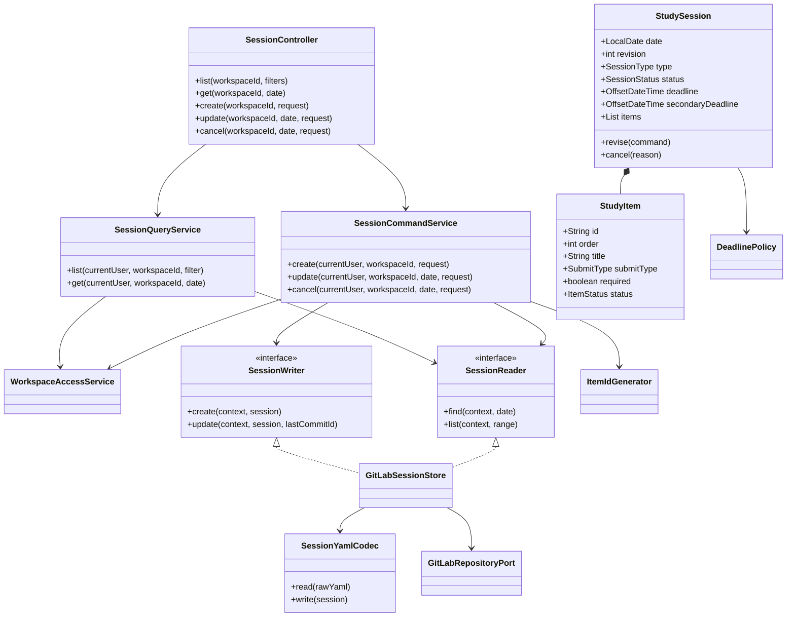
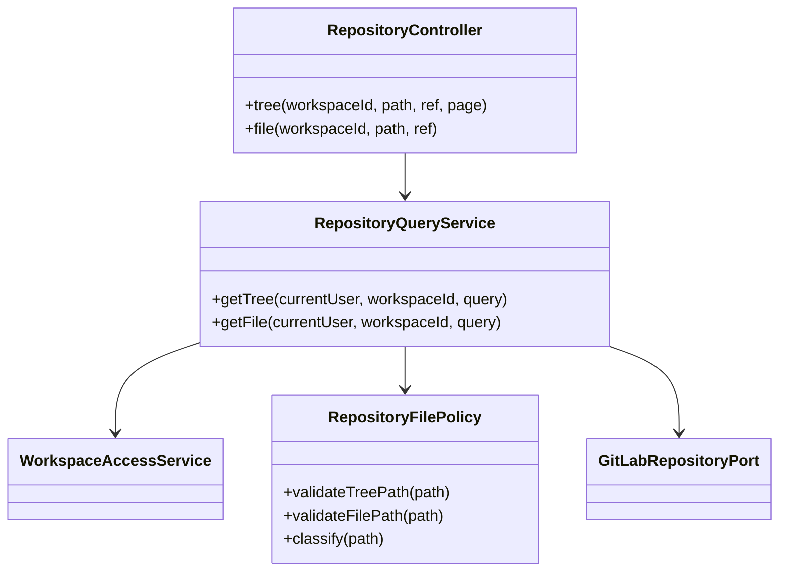
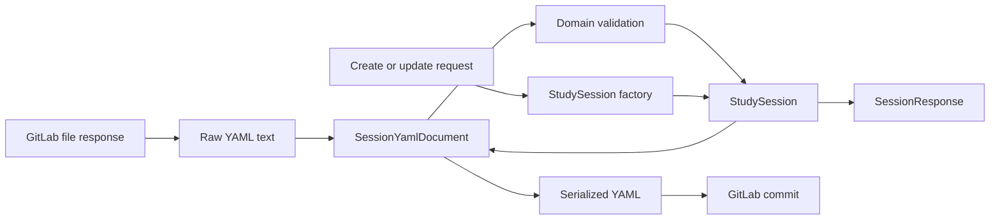
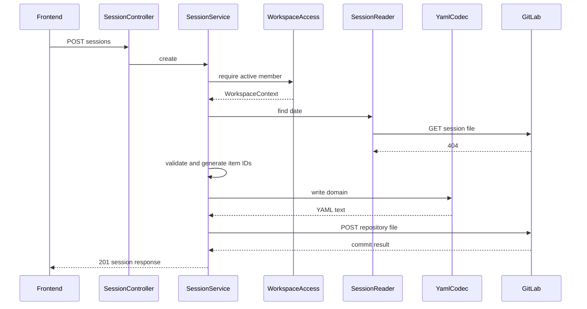
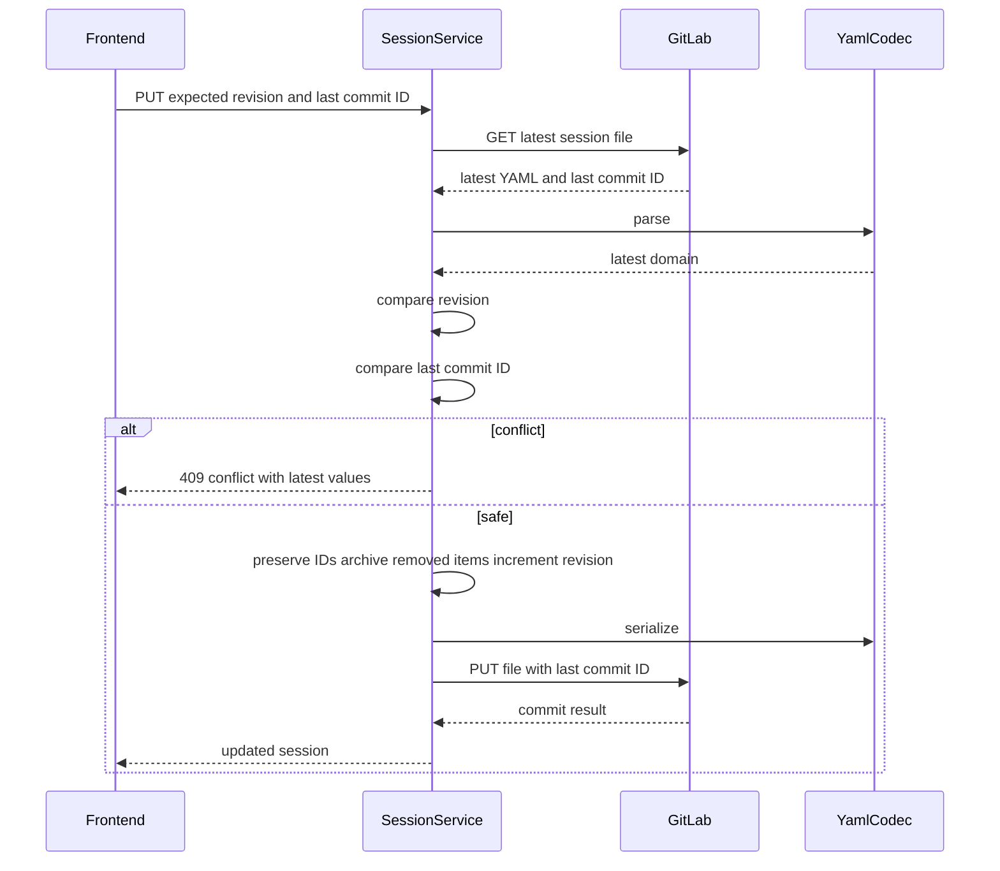

# 팀원 2 초심자 구현 핸드북 — 일정·저장소

이 문서는 GitLab Repository Files API와 YAML 처리가 처음이어도 일정 기능을 작은 단계로 완성하도록 안내합니다.

함께 열어둘 문서:

- [역할 요구사항](../backend-role-2-session-repository.md)
- [OpenAPI 계약](../openapi.yaml)
- [공통 오류 계약](../api-error-catalog.md)
- [공통 GitLab Port](../../backend/src/main/java/com/studyworkspace/gitlab/port/GitLabRepositoryPort.java)
- [테스트 fixture](../../backend/src/test/resources/fixtures/repository/session.yml)

## 1. PM 인수인계

### 사용자 문제

사용자는 웹에서 날짜별 학습 일정을 만들고 여러 학습 항목, 제출 방식, 1차·2차 마감을 관리하려고 합니다. 결과는 DB가 아니라 GitLab의 `{YYMMDD}/session.yml`에 남아야 하며, GitLab에서 직접 수정한 내용도 앱에 반영되어야 합니다.

### 완성된 사용자 흐름

1. 사용자가 일정 목록을 기간·유형·상태로 조회합니다.
2. 날짜를 선택하고 학습 항목 여러 개를 입력합니다.
3. 백엔드가 서버에서 날짜 폴더와 item ID를 생성합니다.
4. `{YYMMDD}/session.yml`을 GitLab에 commit합니다.
5. 다른 멤버가 일정 상세를 조회해 같은 revision과 commit ID를 받습니다.
6. 수정할 때 기존 revision과 `lastCommitId`를 함께 보냅니다.
7. 누군가 먼저 수정했다면 덮어쓰지 않고 `409`를 반환합니다.
8. 일정 취소는 파일 삭제가 아니라 `status: cancelled`로 기록합니다.
9. 저장소 화면은 허용된 텍스트 파일만 읽을 수 있습니다.

### 인수 조건

| 조건 | 검증 |
|---|---|
| 날짜 `2026-07-23`가 폴더 `260723`으로 변환 | 단위 테스트 |
| YAML을 읽고 쓰면 핵심 값이 유지 | round-trip 테스트 |
| 같은 날짜 일정 중복 생성은 `409` | 서비스 테스트 |
| 2차 마감은 1차 마감 이후 | 도메인 테스트 |
| 수정 시 revision과 `lastCommitId` 모두 확인 | 충돌 테스트 |
| 삭제 요청은 파일을 삭제하지 않음 | GitLab Mock 요청 검사 |
| `../`, 절대 경로, 허용하지 않은 확장자 차단 | 경로 정책 테스트 |
| 100개를 넘는 tree도 페이지를 끝까지 조회 | pagination 테스트 |

### 담당하지 않는 것

- 로그인 사용자·Workspace DB: 팀원 1
- 멤버 제출 Markdown 병합: 팀원 3
- 완료율·점수 계산: 팀원 3
- GitLab token 복호화·refresh: 팀원 1

## 2. 핵심 원칙

### GitLab이 원본

Session 상세을 별도 DB 테이블에 복제해 원본처럼 사용하지 않습니다. 캐시할 수는 있지만 언제든 GitLab 파일에서 다시 만들 수 있어야 합니다.

### 세 가지 모델을 분리

```text
API DTO
  사용자가 보내고 받는 JSON

Domain
  날짜, revision, deadline 규칙을 가진 객체

YAML Document
  session.yml 모양과 정확히 대응하는 직렬화 객체
```

Controller Request를 바로 YAML로 직렬화하면 서버 생성 필드와 도메인 검증이 빠지기 쉽습니다.

### 두 단계 충돌 검사

- `revision`: 일정 도메인 버전
- `lastCommitId`: GitLab 파일 버전

둘 중 하나라도 다르면 수정하지 않습니다.

## 3. 추가할 의존성

```gradle
implementation 'com.fasterxml.jackson.dataformat:jackson-dataformat-yaml'
```

추가 후:

```bash
cd backend
./gradlew test
```

직접 `new ObjectMapper()`를 여러 곳에서 만들지 않고 `SessionYamlConfig`에서 하나를 Bean으로 제공합니다.

## 4. 최종 패키지 구조

```text
com.studyworkspace/
├── session/
│   ├── controller/SessionController.java
│   ├── dto/CreateSessionRequest.java
│   ├── dto/UpdateSessionRequest.java
│   ├── dto/CancelSessionRequest.java
│   ├── dto/SessionResponse.java
│   ├── service/SessionCommandService.java
│   ├── service/SessionQueryService.java
│   ├── service/SessionReader.java
│   ├── service/SessionWriter.java
│   ├── domain/StudySession.java
│   ├── domain/StudyItem.java
│   ├── domain/SessionType.java
│   ├── domain/SessionStatus.java
│   ├── domain/SubmitType.java
│   ├── domain/SessionPath.java
│   ├── domain/DeadlinePolicy.java
│   ├── domain/ItemIdGenerator.java
│   ├── infrastructure/yaml/SessionYamlCodec.java
│   ├── infrastructure/yaml/SessionYamlDocument.java
│   └── infrastructure/gitlab/GitLabSessionStore.java
└── repository/
    ├── controller/RepositoryController.java
    ├── dto/RepositoryTreeResponse.java
    ├── dto/RepositoryFileResponse.java
    ├── service/RepositoryQueryService.java
    └── service/RepositoryFilePolicy.java
```

`GitLabClient`를 새로 만들지 않습니다. 공통 `GitLabRepositoryPort`를 사용하고 부족한 메서드는 팀 리뷰 후 공통 Port에 추가합니다.

## 5. UML 클래스 다이어그램

### Session



### Repository



## 6. YAML과 Domain 매핑



### YAML Document

```java
public record SessionYamlDocument(
    int version,
    int revision,
    LocalDate date,
    String type,
    String title,
    String description,
    String status,
    OffsetDateTime deadline,
    OffsetDateTime secondaryDeadline,
    OffsetDateTime updatedAt,
    UpdatedByDocument updatedBy,
    ChangeDocument change,
    List<SessionItemDocument> items
) {
}
```

YAML Document는 문자열 enum과 nullable field를 허용할 수 있습니다. Domain으로 변환할 때 엄격히 검증합니다.

### Domain

```java
public final class StudySession {
    private final LocalDate date;
    private int revision;
    private SessionType type;
    private String title;
    private String description;
    private SessionStatus status;
    private OffsetDateTime deadline;
    private OffsetDateTime secondaryDeadline;
    private List<StudyItem> items;

    public void revise(SessionRevisionCommand command) {
        DeadlinePolicy.validate(
            command.deadline(),
            command.secondaryDeadline()
        );
        this.revision += 1;
        // 나머지 안전한 값 교체
    }
}
```

## 7. 저장 경로 규칙

### 날짜 폴더

```java
public record SessionPath(LocalDate date) {
    private static final DateTimeFormatter FOLDER =
        DateTimeFormatter.ofPattern("yyMMdd");

    public String folder() {
        return date.format(FOLDER);
    }

    public String sessionFile() {
        return folder() + "/session.yml";
    }
}
```

테스트:

```text
2026-07-03 → 260703/session.yml
2000-01-01 → 000101/session.yml
```

서버 timezone과 무관하게 `LocalDate`만 사용합니다.

### 허용 파일

초기 허용 확장자:

```text
.yml .yaml .md .txt .java .py .cpp .js .ts
```

금지:

```text
/absolute/path
../secret
260723/../../secret
path\windows
빈 경로
NUL 문자
1MB 초과 파일
```

URL decode를 한 뒤에도 다시 검사해야 이중 인코딩 우회를 막을 수 있습니다.

## 8. Deadline 규칙

```java
public final class DeadlinePolicy {
    public static void validate(
        OffsetDateTime primary,
        OffsetDateTime secondary
    ) {
        if (primary == null) {
            throw SessionException.deadlineRequired();
        }
        if (secondary != null && !secondary.isAfter(primary)) {
            throw SessionException.secondaryDeadlineInvalid();
        }
    }
}
```

규칙:

- 1차 마감은 필수
- 2차 마감은 선택
- 2차는 1차보다 반드시 늦음
- API는 timezone 포함 시각
- YAML도 timezone을 제거하지 않음

## 9. Item ID와 수정 규칙

### 생성

서버가 `item-` + 랜덤 hex를 생성합니다.

```java
public interface ItemIdGenerator {
    String nextId();
}
```

테스트에서는 고정 generator를 주입합니다.

### 수정

- request에 기존 ID가 있고 현재 활성 item과 일치하면 ID 유지
- 새 항목은 새 ID 발급
- 제거한 항목은 재사용하지 않음
- 이미 제출이 있는 제거 항목은 `cancelled`로 보존
- 순서만 바뀌면 ID는 유지하고 `order`만 변경

제목을 ID로 사용하면 제목 수정 시 제출 연결이 끊어집니다.

## 10. 생성 시퀀스



`404`만 “없음”으로 처리합니다. `403`, `429`, timeout을 “없음”으로 바꾸면 안 됩니다.

## 11. 수정 시퀀스



수정 전에 반드시 GitLab 최신 파일을 다시 읽습니다. 화면을 열 때 받은 값만 믿고 PUT하면 동시 수정이 덮어써질 수 있습니다.

## 12. 취소 시퀀스

취소는 `DELETE` HTTP 메서드를 사용하지만 GitLab 파일은 `PUT`으로 수정합니다.

```text
API DELETE session
→ 최신 YAML 조회
→ revision과 lastCommitId 확인
→ status = cancelled
→ revision + 1
→ change reason 기록
→ GitLab PUT session.yml
```

GitLab Repository File DELETE를 호출하지 않습니다.

## 13. Repository tree pagination

현재 공통 스파이크는 `per_page=100` 첫 페이지만 읽습니다. 실제 Workspace API는 페이지를 끝까지 처리해야 합니다.

초기 구현은 단순 page pagination으로 시작합니다.

```text
page = 1
result = []

반복:
  GitLab GET tree?page=page&per_page=100
  items를 result에 추가
  X-Next-Page가 비었으면 종료
  page = X-Next-Page
```

무한 루프를 막기 위해 최대 페이지 수 또는 총 항목 수 제한을 둡니다.

Repository Controller는 GitLab page header를 앱 `PageMeta`로 변환할 수도 있습니다. 전체 recursive tree가 꼭 필요한 화면인지 프론트와 먼저 합의하세요.

## 14. 단계별 구현

### 0단계: 브랜치

```bash
git switch master
git pull gitlab master
git switch -c feat/member2-session-repository
```

### 1단계: 값 객체

다음 순서로 순수 Java 테스트부터 작성합니다.

1. `SessionPath`
2. `DeadlinePolicy`
3. enum parse
4. `StudyItem`
5. `StudySession`
6. `ItemIdGenerator`

Spring context 없이 빠르게 실행되어야 합니다.

### 2단계: YAML read

1. fixture `session.yml`을 읽습니다.
2. `SessionYamlDocument`로 역직렬화합니다.
3. Domain으로 변환합니다.
4. 필수 필드 누락을 `INVALID_SESSION_FILE`로 변환합니다.

```java
public StudySession read(String rawYaml) {
    try {
        SessionYamlDocument document =
            yamlMapper.readValue(rawYaml, SessionYamlDocument.class);
        return mapper.toDomain(document);
    } catch (JacksonException exception) {
        throw SessionException.invalidFile(exception.getOriginalMessage());
    }
}
```

응답에 parser stack trace를 넣지 않습니다.

### 3단계: YAML write와 round trip

```java
String yaml = codec.write(session);
StudySession restored = codec.read(yaml);
assertThat(restored).usingRecursiveComparison().isEqualTo(session);
```

날짜, timezone, item 순서, null 2차 마감, 한글이 유지되는지 확인합니다.

### 4단계: GitLabSessionStore

```java
public final class GitLabSessionStore
    implements SessionReader, SessionWriter {

    private final GitLabRepositoryPort gitLab;
    private final SessionYamlCodec codec;

    public StoredSession get(WorkspaceContext context, LocalDate date) {
        String path = new SessionPath(date).sessionFile();
        GitLabFileResponse file =
            gitLab.getRepositoryFile(path, context.defaultBranch());
        return new StoredSession(
            codec.read(decode(file)),
            file.lastCommitId()
        );
    }
}
```

공통 Client에 token 전달 방식이 현재 PAT에서 사용자 OAuth로 바뀌므로 팀원 1의 `GitLabTokenProvider` 계약을 확인합니다.

### 5단계: Query Service

- 날짜 상세
- from/to 목록
- type/status filter
- 잘못된 날짜 폴더 무시
- YAML 오류는 조용히 무시하지 않고 명확한 오류

처음에는 순차 조회로 정확하게 만들고, 테스트 후 제한된 병렬 조회를 고려합니다.

### 6단계: Create Service

```text
Workspace 권한
→ 날짜 중복 확인
→ 요청 검증
→ item ID 생성
→ revision 1
→ actor와 updatedAt
→ YAML
→ GitLab POST
→ 응답
```

commit message:

```text
study: create session 260723
```

### 7단계: Update Service

```text
Workspace 권한
→ 최신 파일 조회
→ expectedRevision 비교
→ lastCommitId 비교
→ item 병합
→ revision 증가
→ changeReason 기록
→ GitLab PUT with last_commit_id
```

GitLab `400`이 오면 최신 파일을 다시 읽어 commit ID가 달라졌는지 확인하고 `REPOSITORY_FILE_CONFLICT`로 변환합니다.

### 8단계: Cancel Service

파일 삭제 없이 상태를 변경합니다. 두 번 취소할 때 정책을 정합니다.

권장:

- 이미 cancelled면 같은 상태를 반환하는 idempotent 처리
- revision을 불필요하게 다시 올리지 않음

### 9단계: Repository API

1. Workspace 접근 검사
2. ref 미지정 시 Workspace default branch
3. path policy
4. tree pagination
5. 1MB 제한
6. UTF-8 text decode
7. 확장자 분류
8. GitLab web URL 생성

## 15. API와 클래스 매핑

| API | Controller | Service |
|---|---|---|
| Session 목록·상세 | `SessionController` | `SessionQueryService` |
| Session 생성·수정·취소 | `SessionController` | `SessionCommandService` |
| Repository tree | `RepositoryController` | `RepositoryQueryService` |
| Repository file | `RepositoryController` | `RepositoryQueryService` |

OpenAPI Request 필드명을 임의로 바꾸지 않습니다.

## 16. 오류 변환

| 상황 | Code |
|---|---|
| YAML 문법·필드 오류 | `INVALID_SESSION_FILE` |
| 날짜 없음 | `SESSION_NOT_FOUND` |
| 같은 날짜 생성 | `SESSION_ALREADY_EXISTS` |
| revision 불일치 | `SESSION_REVISION_CONFLICT` |
| commit ID 불일치 | `REPOSITORY_FILE_CONFLICT` |
| 잘못된 2차 마감 | `SECONDARY_DEADLINE_INVALID` |
| 금지 경로 | `FILE_PATH_NOT_ALLOWED` |
| 1MB 초과 | `REPOSITORY_FILE_TOO_LARGE` |

충돌 `details` 예:

```json
{
  "expectedRevision": 3,
  "actualRevision": 4,
  "expectedLastCommitId": "old",
  "actualLastCommitId": "new"
}
```

## 17. 테스트 표

### Domain

- 폴더 날짜 변환
- 필수 deadline
- 2차 마감 순서
- item ID 유지
- 제거 item archive
- revision 증가
- cancel idempotency

### YAML

- fixture parse
- write/read round trip
- 한글과 multiline
- 2차 마감 없음
- 알 수 없는 enum
- 필수 필드 없음
- 중복 item ID
- item order 중복·누락

### Service

- 생성 성공
- 같은 날짜 중복
- Workspace 비멤버
- revision 충돌
- commit 충돌
- GitLab 403·404·429·timeout
- GitLab commit 거부 후 최신값 확인
- 취소가 PUT을 호출하고 DELETE를 호출하지 않음

### Repository

- 정상 상대 경로
- traversal
- 절대 경로
- Windows 구분자
- 허용·금지 확장자
- 파일 크기 경계 1MB
- tree 2페이지 이상

Mock Port 예:

```java
final class FakeSessionStore implements SessionReader, SessionWriter {
    private StoredSession stored;

    // 테스트가 호출 결과와 전달 lastCommitId를 검사할 수 있게 구현
}
```

## 18. 권장 Merge Request

1. `feat(session): validate path and deadlines`
2. `feat(session): parse session yaml fixture`
3. `feat(session): serialize session yaml`
4. `feat(session): read session from GitLab`
5. `feat(session): create session file`
6. `feat(session): update with optimistic lock`
7. `feat(session): cancel without deleting file`
8. `feat(repository): list paginated tree`
9. `feat(repository): preview allowed text file`
10. `test(session): cover malformed files and conflicts`

## 19. 막힐 때

### YAML date가 숫자나 다른 형식으로 읽힘

1. Document 필드가 `LocalDate`, `OffsetDateTime`인지 확인
2. Java Time module 등록 확인
3. fixture에 timezone이 있는지 확인
4. 문자열로 받은 뒤 명시적으로 parse하는 방법 검토

### 파일 경로가 GitLab에서 404

1. raw path와 URL encoded path 구분
2. `pathSegment`가 `/`를 올바르게 encoding하는지 Mock 테스트
3. ref가 Workspace 기본 브랜치인지 확인
4. project ID를 프론트에서 받지 않았는지 확인

### 수정이 가끔 덮어써짐

1. 수정 직전에 최신 파일을 다시 읽는지 확인
2. revision과 `lastCommitId`를 둘 다 비교하는지 확인
3. GitLab PUT body에 `last_commit_id`가 있는지 확인
4. 두 스레드 동시 테스트 작성

### 목록이 일부만 보임

1. GitLab `X-Next-Page` 확인
2. `per_page=100`만 넣고 한 페이지만 읽지 않는지 확인
3. recursive와 path query 확인

## 20. 구현 후 설명할 수 있어야 하는 것

1. Session을 DB가 아닌 GitLab에 저장하는 이유와 단점은 무엇인가?
2. API DTO, Domain, YAML Document를 나누는 이유는 무엇인가?
3. revision과 `last_commit_id`를 모두 사용하는 이유는 무엇인가?
4. 취소할 때 파일을 삭제하지 않는 이유는 무엇인가?
5. item 제목 대신 안정적인 ID가 필요한 이유는 무엇인가?
6. 제거된 item을 archive하는 이유는 무엇인가?
7. GitLab 404와 네트워크 오류를 구분해야 하는 이유는 무엇인가?
8. tree pagination을 빠뜨리면 어떤 버그가 생기는가?
9. 경로 검증을 프론트가 아니라 서버에서 하는 이유는 무엇인가?
10. round-trip 테스트가 보장하는 것은 무엇인가?
