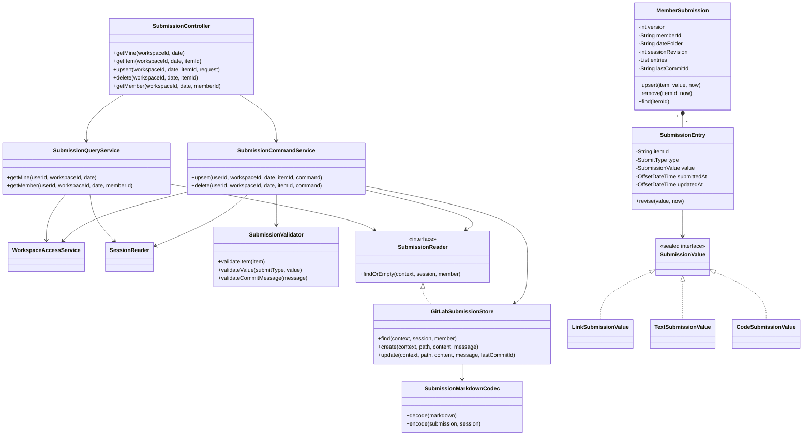
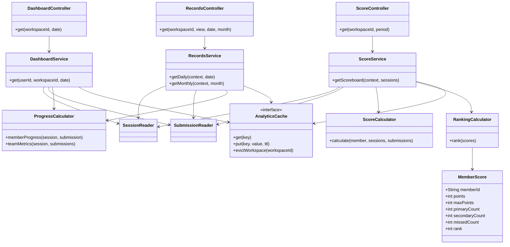
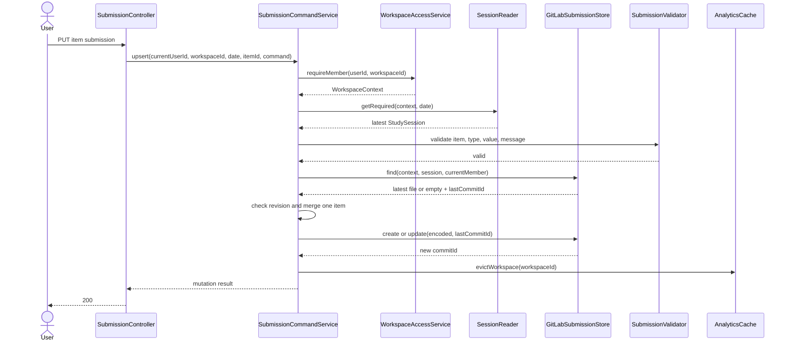

# 팀원 3 초심자 구현 핸드북 — 제출·대시보드·기록·점수

이 문서는 Spring 서비스 계층, Markdown front matter, GitLab 파일 병합이 처음이어도 제출 기능을 작은 단계로 완성하도록 안내합니다. 코드를 한 번에 전부 작성하지 말고, 각 단계의 테스트가 통과한 뒤 다음 단계로 이동하세요.

함께 열어둘 문서:

- [역할 요구사항](../backend-role-3-submission-analytics.md)
- [OpenAPI 계약](../openapi.yaml)
- [공통 오류 계약](../api-error-catalog.md)
- [팀원 1 핸드북](member-1-auth-workspace-handbook.md)
- [팀원 2 핸드북](member-2-session-repository-handbook.md)
- [프론트 점수 계산 기준](../../frontend/lib/domain/metrics.ts)
- [제출 fixture](../../backend/src/test/resources/fixtures/repository/member-a.md)
- [공통 GitLab Port](../../backend/src/main/java/com/studyworkspace/gitlab/port/GitLabRepositoryPort.java)

## 1. PM 인수인계

### 1.1 사용자 문제

스터디 멤버는 블로그 링크, 풀이 설명, 코드를 웹에서 제출하고 싶습니다. 팀장은 누가 어떤 항목을 제출했는지 GitLab에서 확인하고 싶고, 멤버는 자신의 진행률·기록·점수를 한눈에 보고 싶습니다.

한 항목을 수정할 때 다른 항목의 제출을 잃으면 안 됩니다. 늦게 내용을 보완하더라도 최초 제출 시각을 바꾸어 점수를 높일 수 없어야 하며, 두 사람이 같은 파일을 동시에 수정해도 마지막 요청이 조용히 앞 요청을 덮어쓰면 안 됩니다.

### 1.2 완성된 사용자 흐름

1. 로그인 사용자가 오늘의 Session과 자신의 제출 상태를 조회합니다.
2. 링크·텍스트·코드 중 일정에 지정된 방식으로 한 항목을 제출합니다.
3. 서버가 사용자와 Workspace 멤버 매핑으로 GitLab 파일 경로를 계산합니다.
4. 서버가 최신 멤버 Markdown 파일과 최신 Session을 다시 읽습니다.
5. 요청한 item 하나만 병합하고 나머지 제출은 그대로 보존합니다.
6. 파일이 없으면 생성하고, 있으면 `last_commit_id`를 포함해 수정합니다.
7. 저장 성공 후 관련 대시보드·기록·점수 캐시를 무효화합니다.
8. 사용자는 새 진행률과 점수를 확인합니다.
9. 다른 멤버의 제출은 읽을 수 있지만 수정할 수 없습니다.
10. 동시 수정 충돌이 발생하면 서버는 무조건 덮어쓰지 않고 `409`로 알려줍니다.

### 1.3 완료 인수 조건

| 조건 | 검증 방법 |
|---|---|
| 사용자가 보낸 파일 경로를 쓰지 않음 | Controller 요청 DTO에 path·memberId 필드가 없는지 확인 |
| 한 item 수정 시 다른 item 유지 | 서비스 테스트 |
| 기존 제출 수정 시 최초 `submittedAt` 유지 | 도메인 테스트 |
| 취소·교체된 item은 현재 완료율과 점수에서 제외 | 계산기 테스트 |
| link는 `http`·`https`만 허용 | 검증기 테스트 |
| code는 저장만 하고 실행하지 않음 | 실행 API·프로세스 호출이 없는지 리뷰 |
| 같은 item 동시 수정은 `409` | 충돌 테스트 |
| 다른 item 동시 수정은 최신 파일에 한 번 재병합 가능 | 재시도 서비스 테스트 |
| 1차 이전 10P, 2차 이전 6P, 이후 0P | 경계 시각 테스트 |
| 수정해도 점수가 올라가지 않음 | 최초 시각 보존 통합 테스트 |
| 동점자는 같은 순위, 다음 순위는 건너뜀 | 순위 테스트 |
| 일별·월별 결과가 같은 원본에서 계산됨 | 기록 서비스 테스트 |
| 파일 쓰기 성공 후에만 캐시 무효화 | 서비스 호출 순서 테스트 |

### 1.4 담당하지 않는 것

- 로그인·OAuth·현재 사용자 조회: 팀원 1
- Workspace와 GitLab 프로젝트 연결: 팀원 1
- Session 생성·수정·YAML 파싱: 팀원 2
- 저장소 전체 탐색 UI용 API: 팀원 2
- 프론트 화면·모달·차트: 프론트 공통 작업

팀원 3은 위 기능을 다시 구현하지 않습니다. 아래 인터페이스만 받아 사용합니다.

```java
WorkspaceContext context =
    workspaceAccessService.requireMember(currentUserId, workspaceId);

StudySession session =
    sessionReader.getRequired(context, date);
```

## 2. 먼저 이해할 네 가지 개념

### 2.1 front matter와 Markdown 본문

멤버 파일은 한 파일에 두 목적을 담습니다.

```text
YAML front matter
  서버가 안전하게 파싱하는 구조화된 원본

Markdown body
  GitLab에서 사람이 읽기 좋은 표현
```

통계와 제출 상태는 반드시 front matter를 기준으로 계산합니다. 본문 제목이나 `(미제출)` 문자열을 정규식으로 읽어 통계를 만들지 않습니다.

### 2.2 항목 단위 병합

요청 하나는 item 하나만 바꿉니다. 파일 전체를 클라이언트가 보내게 하지 않습니다.

```text
기존: [item-a 제출, item-b 제출]
요청: item-b 수정
결과: [item-a 원본 유지, item-b만 수정]
```

### 2.3 최초 제출 시각과 수정 시각

- `submittedAt`: 최초 제출 시각이며 점수 계산 기준
- `updatedAt`: 마지막 내용 수정 시각

기존 제출을 수정할 때 `submittedAt`은 절대 새 시각으로 바꾸지 않습니다.

### 2.4 현재 통계의 대상

현재 완료율과 점수에는 다음 조건을 모두 만족하는 item만 들어갑니다.

```text
item.required == true
item.status == ACTIVE
```

취소되거나 교체된 item의 과거 제출은 파일에서 지우지 않습니다. 기록 보존과 현재 통계 포함 여부는 서로 다른 문제입니다.

## 3. 팀원 간 의존 계약

### 팀원 1에게 받을 것

```java
public record WorkspaceContext(
    UUID workspaceId,
    long gitLabProjectId,
    String gitLabProjectPath,
    String defaultBranch,
    UUID userId,
    long gitLabUserId,
    String memberId,
    String fileName
) {
}
```

위 모양은 팀원 1 핸드북의 계약과 같습니다. 대시보드에 필요한 멤버 목록은 별도 조회 인터페이스로 받습니다.

```java
public interface WorkspaceMemberReader {
    List<WorkspaceMemberView> findActiveMembers(UUID workspaceId);
}

public record WorkspaceMemberView(
    String memberId,
    UUID userId,
    long gitLabUserId,
    String username,
    String displayName,
    String fileName,
    MemberStatus status
) {
}
```

`fileName`은 서버가 검증한 값이어야 합니다. 예: `hong-gildong.md`.

### 팀원 2에게 받을 것

```java
public interface SessionReader {
    StudySession getRequired(WorkspaceContext context, LocalDate date);

    List<StudySession> findRange(
        WorkspaceContext context,
        LocalDate from,
        LocalDate to
    );
}
```

`StudySession`에는 아래 값이 필요합니다.

- 날짜와 GitLab 폴더명
- revision
- 상태
- 1차 마감
- 선택적 2차 마감
- item 목록
- item별 ID, 제목, 필수 여부, 상태, 제출 방식

### 팀원 3이 다른 팀에 제공할 것

```java
public interface SubmissionReader {
    MemberSubmission findOrEmpty(
    WorkspaceContext context,
    StudySession session,
    WorkspaceMemberView member
    );
}
```

이 인터페이스는 대시보드·기록·점수 서비스도 사용합니다. Controller 응답 DTO를 반환하지 말고 도메인 객체를 반환합니다.

## 4. 최종 패키지 구조

```text
com.studyworkspace/
├── submission/
│   ├── controller/
│   │   └── SubmissionController.java
│   ├── dto/
│   │   ├── UpsertSubmissionRequest.java
│   │   ├── SubmissionMutationResponse.java
│   │   ├── ItemSubmissionResponse.java
│   │   └── MemberSubmissionResponse.java
│   ├── service/
│   │   ├── SubmissionCommandService.java
│   │   ├── SubmissionQueryService.java
│   │   ├── SubmissionReader.java
│   │   └── SubmissionValidator.java
│   ├── domain/
│   │   ├── MemberSubmission.java
│   │   ├── SubmissionEntry.java
│   │   ├── SubmissionValue.java
│   │   ├── LinkSubmissionValue.java
│   │   ├── TextSubmissionValue.java
│   │   ├── CodeSubmissionValue.java
│   │   └── SubmissionPath.java
│   └── infrastructure/
│       ├── gitlab/GitLabSubmissionStore.java
│       └── markdown/
│           ├── SubmissionMarkdownCodec.java
│           ├── SubmissionDocument.java
│           └── SubmissionEntryDocument.java
├── dashboard/
│   ├── controller/DashboardController.java
│   ├── dto/DashboardResponse.java
│   └── service/
│       ├── DashboardService.java
│       └── ProgressCalculator.java
└── records/
    ├── controller/
    │   ├── RecordsController.java
    │   └── ScoreController.java
    ├── dto/
    │   ├── RecordsResponse.java
    │   ├── DailyRecordResponse.java
    │   ├── ScoreboardResponse.java
    │   └── ScoreEntryResponse.java
    ├── service/
    │   ├── RecordsService.java
    │   └── ScoreService.java
    ├── scoring/
    │   ├── ScoreCalculator.java
    │   ├── ScorePolicy.java
    │   ├── ScoreResult.java
    │   ├── MemberScore.java
    │   └── RankingCalculator.java
    └── cache/
        ├── AnalyticsCache.java
        └── AnalyticsCacheKey.java
```

처음에는 캐시 없이 정확하게 구현해도 됩니다. 캐시는 모든 테스트가 통과한 뒤 마지막 MR에서 추가하세요.

## 5. UML 클래스 다이어그램

### 5.1 제출 생성·수정



### 5.2 대시보드·기록·점수



다이어그램에서 Controller는 계산하지 않습니다. Service가 유스케이스 순서를 관리하고, Calculator는 입력만 받아 순수 계산합니다.

## 6. 제출 파일 계약

### 6.1 저장 예시

```markdown
---
version: 1
memberId: 11
gitlabUserId: 101
username: gitlab-user-a
date: 260723
sessionRevision: 3
sessionType: algorithm
updatedAt: 2026-07-23T20:10:00+09:00
submissions:
  - itemId: item-a8f11c
    type: link
    value: https://blog.example.com/rotation
    submittedAt: 2026-07-23T20:10:00+09:00
    updatedAt: 2026-07-23T20:10:00+09:00
---

# 큐와 배열 집중 학습

## 행렬 테두리 회전하기

https://blog.example.com/rotation

## 프로세스

(미제출)
```

### 6.2 원본과 파생 데이터

| 값 | 원본 | 설명 |
|---|---|---|
| item 제출 값 | front matter | API·통계가 읽는 값 |
| 제출 시각 | front matter | 점수 기준 |
| 본문 제목 | Session | 저장할 때 새로 렌더링 |
| `(미제출)` | 파생 | 사람이 보기 위한 표현 |
| 점수 | 계산 결과 | 파일에 저장하지 않음 |
| 순위 | 계산 결과 | 파일에 저장하지 않음 |

본문은 저장할 때 최신 Session 제목과 순서로 다시 생성합니다. 사용자가 GitLab에서 본문만 편집한 값은 다음 앱 저장 시 사라질 수 있음을 README에 안내하세요.

### 6.3 Markdown codec 책임

```java
public interface SubmissionMarkdownCodec {
    MemberSubmission decode(
        String rawMarkdown,
        String lastCommitId
    );

    String encode(
        MemberSubmission submission,
        StudySession session
    );
}
```

구현 순서:

1. 파일이 `---`로 시작하는지 확인합니다.
2. 두 번째 `---` 구분자의 위치를 찾습니다.
3. 두 구분자 사이 YAML만 Jackson YAML로 파싱합니다.
4. Document DTO를 도메인 객체로 변환하며 필수 필드를 검증합니다.
5. 저장할 때 도메인을 Document DTO로 변환합니다.
6. YAML을 직렬화한 뒤 Session 기준 Markdown 본문을 생성합니다.
7. 파일 끝에 개행 하나를 둡니다.

정규식 하나로 YAML 전체를 파싱하지 마세요. 코드 제출 안에 `---`가 들어갈 수 있으므로 첫 줄과 front matter 종료 구분자를 명확히 처리합니다.

### 6.4 round-trip 테스트

```java
@Test
void decodeEncodeDecodePreservesStructuredValues() {
    MemberSubmission first = codec.decode(fixture, "commit-1");

    String encoded = codec.encode(first, session);
    MemberSubmission second = codec.decode(encoded, "commit-2");

    assertThat(second.entries()).containsExactlyElementsOf(first.entries());
    assertThat(second.sessionRevision()).isEqualTo(first.sessionRevision());
}
```

한글, URL query string, 여러 줄 text, 백틱이 포함된 code를 각각 fixture로 테스트하세요.

## 7. 파일 경로 정책

클라이언트 요청에는 파일 경로가 없습니다.

```java
public record SubmissionPath(String value) {
    public static SubmissionPath of(
        StudySession session,
        WorkspaceMemberView member
    ) {
        String folder = session.folder();
        String fileName = member.fileName();
        validateFolder(folder);
        validateFileName(fileName);
        return new SubmissionPath(folder + "/" + fileName);
    }
}
```

허용 예:

```text
260723/hong-gildong.md
```

거부 예:

```text
../admin.md
/etc/passwd
260723/a/b.md
260723/member.yml
```

검증 규칙:

- folder는 정확히 숫자 6자리
- fileName은 `/`, `\`, `..`를 포함하지 않음
- 확장자는 `.md`
- 최종 경로를 만든 뒤 공통 `RepositoryPathPolicy`도 통과
- 프로젝트 ID와 branch는 `WorkspaceContext` 값만 사용

## 8. 제출 값과 커밋 메시지 검증

### 8.1 API 요청

OpenAPI의 `UpsertSubmissionRequest`를 기준으로 합니다. 경로·멤버·제출 시각은 받지 않습니다.

```java
public record UpsertSubmissionRequest(
    String type,
    String value,
    String language,
    String expectedFileCommitId,
    String commitMessage
) {
}
```

`type`, `value`, `commitMessage`는 필수이고 `language`, `expectedFileCommitId`는 선택입니다. 이미 파일이 존재한다면 `expectedFileCommitId`가 필요합니다. 구현 시 [OpenAPI](../openapi.yaml)를 최종 기준으로 맞추세요.

### 8.2 타입별 규칙

| 타입 | 검증 | 권장 최대 길이 |
|---|---|---:|
| `link` | 절대 URI, scheme `http` 또는 `https`, host 존재 | 2,000자 |
| `text` | 공백만 있는 값 금지 | 20,000자 |
| `code` | 공백만 있는 값 금지, 실행 금지 | 50,000자 |

code의 language는 화면 표시용 문자열입니다. `java`, `python`, `javascript`, `text`처럼 허용 목록을 두고, Markdown fence에는 검증된 값만 넣습니다.

### 8.3 Session item과 타입 일치

```java
if (item.submitType() != request.submitType()) {
    throw new SubmissionTypeMismatchException(
        item.id(),
        item.submitType(),
        request.submitType()
    );
}
```

`required == false`인 선택 항목도 제출할 수 있습니다. 다만 현재 완료율과 점수에는 포함하지 않습니다.

### 8.4 커밋 메시지

권장 규칙:

- trim 후 비어 있으면 서버 기본 메시지 사용
- 최대 200자
- `\r`, `\n`, 탭 외 제어 문자 금지
- token·비밀번호처럼 보이는 값은 기록하지 않도록 UI 안내

기본 메시지 예:

```text
study: 2026-07-23 item-a8f11c 제출
study: 2026-07-23 item-a8f11c 제출 수정
study: 2026-07-23 item-a8f11c 제출 제거
```

## 9. 도메인 병합 알고리즘

### 9.1 새 제출

```java
public MemberSubmission upsert(
    StudyItem item,
    SubmissionValue value,
    OffsetDateTime now
) {
    SubmissionEntry current = find(item.id()).orElse(null);

    if (current == null) {
        entries.add(SubmissionEntry.create(
            item.id(),
            item.submitType(),
            value,
            now,
            now
        ));
    } else {
        current.revise(value, now);
    }

    this.updatedAt = now;
    return this;
}
```

### 9.2 기존 제출 수정

```java
public SubmissionEntry revise(
    SubmissionValue newValue,
    OffsetDateTime now
) {
    return new SubmissionEntry(
        itemId,
        type,
        newValue,
        submittedAt, // 기존 최초 시각을 그대로 사용
        now
    );
}
```

`submittedAt = now`로 쓰면 안 됩니다. 이 한 줄이 점수 조작 버그를 만듭니다.

### 9.3 제출 제거

- 요청한 entry만 목록에서 제거
- 다른 entry 유지
- 멤버 Markdown 파일 자체는 유지
- `updatedAt` 갱신
- 없는 entry를 지울 때는 팀 규칙을 하나로 정함

권장 규칙은 없는 entry 삭제를 성공으로 처리하는 멱등성입니다. 응답에는 `status: NOT_SUBMITTED`를 반환합니다.

### 9.4 revision 확인

쓰기 직전에 다음 값을 비교합니다.

```text
latest session.revision
member file.sessionRevision
request.expectedFileCommitId
latest member file.lastCommitId
```

- 파일 revision과 최신 Session이 다르면 `SUBMISSION_REVISION_MISMATCH`
- 요청 commit ID와 최신 멤버 파일 commit ID가 다르면 충돌 처리
- 파일 revision이 오래됐지만 item이 아직 활성이고 호환 가능하면 최신 revision으로 재렌더링하는 정책을 명시
- item이 교체·취소됐으면 제출 차단

현재 OpenAPI 요청에는 예상 Session revision이 없습니다. 화면이 읽은 Session 자체의 낙관적 잠금까지 필요해지면 필드를 서비스에만 몰래 추가하지 말고 OpenAPI를 함께 변경하세요. 초기 버전에서는 파일 revision 불일치를 안전하게 오류로 처리한 뒤, 나중에 호환 마이그레이션을 추가해도 됩니다.

## 10. 제출 쓰기 시퀀스



캐시 무효화는 GitLab 쓰기 성공 이후에만 합니다. 쓰기가 실패했는데 캐시만 지우는 것은 데이터 오류는 아니지만 불필요한 부하를 만듭니다.

## 11. 동시 수정과 충돌

### 11.1 왜 `last_commit_id`가 필요한가

두 브라우저가 같은 파일을 읽고 서로 다른 변경을 저장할 수 있습니다.

```text
브라우저 A 읽음: commit 10
브라우저 B 읽음: commit 10
A 저장 성공: commit 11
B가 commit 10 기준으로 저장 시도: 충돌
```

GitLab update 요청에 마지막으로 읽은 commit ID를 넣어 조용한 덮어쓰기를 막습니다.

### 11.2 한 번만 재병합할 수 있는 경우

```text
A가 item-a 수정
B가 item-b 수정
```

B의 첫 저장이 충돌하면 최신 파일을 한 번 다시 읽습니다. 최초 읽은 파일과 최신 파일에서 `item-b`가 같다면 다른 item만 변경된 것이므로 B의 item-b 변경을 최신 파일에 재병합해 한 번 더 저장할 수 있습니다.

### 11.3 자동 재시도하면 안 되는 경우

```text
A와 B가 모두 item-a 수정
```

최신 파일의 item-a가 최초 읽은 값과 다르면 사용자의 선택이 필요합니다. `SUBMISSION_CONFLICT`와 최신 commit ID를 반환하고 UI에서 다시 불러오도록 안내합니다.

### 11.4 재시도 의사 코드

```java
try {
    return store.update(merged, originalLastCommitId);
} catch (GitLabConflictException firstConflict) {
    MemberSubmission latest = store.getRequired(...);

    if (changed(latest.find(itemId), originallyRead.find(itemId))) {
        throw new SubmissionConflictException(itemId);
    }

    MemberSubmission retried = latest.upsert(item, value, clock.now());
    return store.update(retried, latest.lastCommitId());
}
```

재시도 횟수는 한 번입니다. 무한 반복하지 않습니다.

## 12. 조회 서비스

### 12.1 내 제출 조회

1. Workspace 멤버 권한 확인
2. 최신 Session 조회
3. 서버에서 내 제출 경로 계산
4. 파일 없음은 빈 `MemberSubmission`으로 변환
5. 각 Session item과 entry를 연결
6. active·required·submitted 상태를 응답 DTO로 변환

파일 없음은 정상 상태입니다. `404`를 사용자 오류로 반환하지 않습니다.

### 12.2 다른 멤버 제출 조회

- 요청자가 Workspace 멤버인지 먼저 확인
- 대상 memberId가 같은 Workspace 소속인지 확인
- 대상의 서버 저장 `submissionFileName`으로 경로 계산
- 원문 code·text 공개 범위는 팀 정책에 따름
- 수정 API는 제공하지 않음

### 12.3 일부 잘못된 파일

`SUBMISSION_FILE_INVALID`에는 내부 YAML 전체를 넣지 않습니다. 아래처럼 진단 가능한 최소 정보만 응답·로그에 남깁니다.

```text
workspaceId
date folder
memberId
path
field name
GitLab correlation ID
```

token과 제출 원문은 로그에 남기지 않습니다.

## 13. 완료율 계산

### 13.1 순수 계산기

```java
public MemberProgress calculate(
    StudySession session,
    MemberSubmission submission
) {
    List<StudyItem> required = session.items().stream()
        .filter(StudyItem::required)
        .filter(item -> item.status() == ItemStatus.ACTIVE)
        .toList();

    long completed = required.stream()
        .filter(item -> submission.hasEntry(item.id()))
        .count();

    int rate = required.isEmpty()
        ? 100
        : (int) Math.round(completed * 100.0 / required.size());

    return MemberProgress.of(completed, required.size(), rate);
}
```

현재 프론트 기준으로 필수 활성 항목이 0개면 개인 완료율은 `100%`입니다. 할 일이 없으므로 개인은 완료로 보는 규칙입니다.

### 13.2 상태

```text
completed == 0                 -> NOT_STARTED
0 < completed < requiredCount -> PARTIAL
completed == requiredCount    -> COMPLETED
```

필수 항목이 0개인 경우 `completed == requiredCount`이므로 API에서는 `COMPLETED`로 처리합니다. 현재 프론트 내부 모델의 `COMPLETE`는 응답 변환 시 API의 `COMPLETED`에 대응시킵니다.

### 13.3 팀 지표

```text
totalRequiredSubmissions
= 각 활성 멤버의 required item 개수

submittedItems
= 각 활성 멤버의 제출된 required item 개수

submissionRate
= round(submittedItems / totalRequiredSubmissions × 100)
```

활성 멤버 또는 필수 항목이 없어 분모가 0이면 팀 제출률은 현재 프론트 기준 `0%`입니다.

멤버 상태가 `INACTIVE`면 현재 대시보드와 순위에서 제외합니다.

## 14. 점수 계산

### 14.1 고정 규칙

```java
public final class ScorePolicy {
    public static final int PRIMARY_POINTS = 10;
    public static final int SECONDARY_POINTS = 6;
}
```

필수이면서 활성 상태인 item마다 최대 10점을 가집니다.

| 최초 제출 시점 | 점수 |
|---|---:|
| `submittedAt <= primaryDeadline` | 10 |
| `primaryDeadline < submittedAt <= secondaryDeadline` | 6 |
| 2차 마감 후 | 0 |
| 2차 마감이 없고 1차 마감 후 | 0 |
| 미제출 | 0 |

마감과 정확히 같은 시각은 해당 구간 점수를 받습니다.

### 14.2 계산기

```java
public ScoreResult pointsFor(
    OffsetDateTime submittedAt,
    OffsetDateTime primaryDeadline,
    OffsetDateTime secondaryDeadline
) {
    if (!submittedAt.isAfter(primaryDeadline)) {
        return ScoreResult.PRIMARY;
    }
    if (secondaryDeadline != null
        && !submittedAt.isAfter(secondaryDeadline)) {
        return ScoreResult.SECONDARY;
    }
    return ScoreResult.MISSED;
}
```

서버 내부 시간은 `OffsetDateTime` 또는 `Instant`로 비교합니다. 문자열 사전순 비교와 서버 기본 timezone 비교를 사용하지 않습니다.

### 14.3 멤버 점수 집계

```text
points         = 각 대상 item 점수 합
maxPoints      = 대상 item 수 × 10
primaryCount   = 10점을 받은 item 수
secondaryCount = 6점을 받은 item 수
missedCount    = 0점 또는 미제출 item 수
```

선택 항목, cancelled item, replaced item은 모든 수에서 제외합니다.

### 14.4 수동 계산 예

| 날짜 | 항목 | 최초 제출 | 결과 |
|---|---|---|---:|
| 7/23 | A | 1차 마감 1분 전 | 10 |
| 7/23 | B | 1차 후, 2차 전 | 6 |
| 7/24 | C | 2차 후 | 0 |
| 7/24 | D | 미제출 | 0 |
| 7/25 | E | 선택 항목 | 계산 제외 |

결과:

```text
points = 16
maxPoints = 40
primaryCount = 1
secondaryCount = 1
missedCount = 2
```

### 14.5 순위 규칙

정렬:

1. points 내림차순
2. primaryCount 내림차순
3. displayName 한글 오름차순

순위 숫자는 points만으로 공동 순위를 결정합니다.

```text
민수 30점 -> 1위
지수 30점 -> 1위
서준 26점 -> 3위
```

primaryCount와 이름은 화면 순서를 안정적으로 만들기 위한 보조 정렬입니다. 같은 점수인데 primaryCount가 다르더라도 순위 숫자는 같습니다.

```java
for (int index = 0; index < sorted.size(); index++) {
    MemberScore current = sorted.get(index);
    int firstSamePointIndex = firstIndexOfPoints(sorted, current.points());
    current.assignRank(firstSamePointIndex + 1);
}
```

## 15. 기록 페이지 계산

### 15.1 일별 보기

입력:

```text
view=day
date=2026-07-23
```

출력에 포함할 값:

- 날짜
- Session 존재 여부와 유형
- 필수 활성 항목 수
- 내 제출 수와 완료율
- 팀 제출률
- 그날 획득 점수
- 제출별 마지막 수정 시각

### 15.2 월별 보기

입력:

```text
view=month
month=2026-07
```

월의 첫날부터 마지막 날까지 Session을 읽고 날짜별 결과를 만듭니다.

```text
averageSubmissionRate = Session이 있는 날짜의 개인 완료율 평균
totalSubmissions      = 기간 내 개인의 필수 활성 item 제출 수
studyDays             = 필수 활성 item을 하나 이상 제출한 날짜 수
```

평균의 분모에 Session이 없는 날짜를 넣지 않습니다. Session은 있지만 필수 항목이 0개인 날을 포함할지는 OpenAPI와 프론트 표시 규칙을 맞춰 테스트로 고정합니다.

### 15.3 날짜·월 이동

백엔드는 이전·다음 버튼 상태를 저장하지 않습니다. 프론트가 선택한 `date` 또는 `month`를 query parameter로 보내고 백엔드는 그 범위만 계산합니다.

유효하지 않은 조합:

```text
view=day인데 date가 없음
view=month인데 month가 없음
date=2026-02-30
month=2026-13
```

이 경우 `VALIDATION_FAILED`를 반환합니다.

## 16. 캐시 설계

처음에는 캐시 없이 완성합니다. GitLab 호출 횟수가 실제로 문제가 될 때 추가합니다.

### 16.1 키

```text
dashboard:{workspaceId}:{date}:{sessionRevision}
records:day:{workspaceId}:{date}
records:month:{workspaceId}:{yearMonth}
scores:{workspaceId}:{from}:{to}
```

사용자별 개인 필드가 결과에 있으면 key에 `memberId`를 추가하거나, 팀 공통 집계와 개인 결과를 분리합니다.

### 16.2 TTL

- Dashboard: 30~60초
- Records: 1~5분
- Scores: 1~5분

TTL 숫자는 코드 여러 곳에 흩뿌리지 않고 설정 값으로 둡니다.

### 16.3 무효화

제출 생성·수정·제거 성공 시:

- 해당 날짜 Dashboard
- 해당 날짜 Daily Records
- 해당 월 Monthly Records
- 해당 기간을 포함할 수 있는 Scores

초기 구현은 `evictWorkspace(workspaceId)`처럼 넓게 지워도 됩니다. 정확성부터 확보한 뒤 키 단위 최적화를 하세요.

## 17. 단계별 구현 설명서

### 단계 0. 계약 테스트부터 복사

1. `docs/openapi.yaml`에서 팀원 3의 `x-owner` API를 찾습니다.
2. 요청·응답 예시 JSON을 테스트 resource에 저장합니다.
3. Controller가 아직 없어 실패하는 테스트를 하나 만듭니다.
4. DTO 이름을 OpenAPI 이름과 맞춥니다.

완료 기준: 어떤 API를 만들지 팀원 모두 같은 JSON으로 설명할 수 있음.

### 단계 1. 제출 값 도메인

구현 파일:

- `SubmissionValue`
- `LinkSubmissionValue`
- `TextSubmissionValue`
- `CodeSubmissionValue`
- `SubmissionEntry`
- `MemberSubmission`

테스트:

- 신규 upsert는 두 시각이 같음
- 수정 upsert는 submittedAt 유지
- 다른 item 유지
- remove는 대상만 제거
- 같은 item ID 중복 금지

완료 기준: Spring·GitLab 없이 순수 Java 테스트 통과.

### 단계 2. Validator

구현:

- Session item 활성 여부
- submit type 일치
- URL scheme
- 값 길이
- code language
- commit message

검증 오류는 `IllegalArgumentException` 하나로 뭉치지 말고 공통 오류 코드로 변환 가능한 예외를 사용합니다.

완료 기준: 정상·경계·비정상 입력 표 기반 테스트 통과.

### 단계 3. Markdown codec

1. fixture 파일 decode
2. 도메인 값 assert
3. encode
4. 다시 decode
5. 구조화 값 동일성 assert

완료 기준: 한글·여러 줄·코드 fence fixture round-trip 통과.

### 단계 4. GitLabSubmissionStore

공통 `GitLabRepositoryPort`만 사용합니다.

```java
MemberSubmission findOrEmpty(...);
GitLabCommitResult create(...);
GitLabCommitResult update(..., String lastCommitId);
```

- URL 인코딩은 공통 client 책임
- Base64 decode도 공통 client 또는 store 한 곳의 책임
- 404 파일 없음과 GitLab 장애를 구분
- token은 로그 금지

완료 기준: Mock GitLab 응답으로 find/create/update 테스트 통과.

### 단계 5. 내 제출 조회

Controller → QueryService → Workspace → Session → Store 순서로 연결합니다.

완료 기준:

- 파일 없음도 200
- 제출 상태가 Session item 순서로 반환
- 내 경로가 서버에서 계산됨

### 단계 6. upsert 서비스

정확한 순서:

1. 현재 사용자 확인
2. Workspace 멤버 권한 확인
3. 최신 Session 읽기
4. item 찾기
5. 요청 검증
6. 최신 제출 파일 읽기
7. revision 확인
8. item 하나 병합
9. Markdown encode
10. create 또는 update
11. 캐시 무효화
12. 새 commit ID 응답

완료 기준: 호출 순서와 저장 content를 서비스 테스트로 검증.

### 단계 7. delete 서비스

upsert와 같은 권한·Session·revision 확인을 사용합니다. 파일 자체 삭제 API는 호출하지 않습니다.

완료 기준: 다른 entry와 파일 metadata가 유지됨.

### 단계 8. 충돌 처리

1. 처음에는 충돌을 모두 `409`로 반환
2. 테스트를 충분히 만든 뒤 다른 item 변경만 한 번 재병합
3. 같은 item 변경은 항상 사용자에게 반환

완료 기준: 최대 재시도 1회가 테스트로 보장됨.

### 단계 9. ProgressCalculator

GitLab·Spring 의존성 없는 순수 클래스로 구현합니다.

완료 기준:

- 필수·선택·취소 조합
- 필수 0개
- 활성·비활성 멤버
- 반올림

### 단계 10. DashboardService

활성 멤버의 파일을 읽어 Calculator에 전달합니다. 처음에는 순차 호출로 정확성을 확인하고, 성능이 필요하면 제한된 동시성을 사용합니다.

한 멤버 파일 조회 실패 정책:

- 파일 없음: 미제출
- 파일 형식 오류: 전체 응답 실패를 권장
- 일시적 GitLab 오류: `502 GITLAB_API_ERROR`

오류를 미제출로 조용히 바꾸면 실제 장애를 진행률 0%로 잘못 보여줍니다.

### 단계 11. ScoreCalculator와 RankingCalculator

순수 계산기로 구현하고 프론트 `metrics.ts`와 같은 fixture를 양쪽 테스트에 사용합니다.

완료 기준: 점수 경계·수정·공동 순위 테스트 통과.

### 단계 12. RecordsService

1. day 범위 구현
2. month 범위 구현
3. 집계 필드 구현
4. 잘못된 query validation
5. 빈 달 처리

완료 기준: 날짜 이동마다 독립적이고 재현 가능한 결과 반환.

### 단계 13. 캐시

캐시 없이 통합 테스트가 모두 통과한 뒤 추가합니다. 캐시 hit/miss보다 무효화 테스트가 더 중요합니다.

완료 기준: 쓰기 직후 이전 결과가 반환되지 않음.

## 18. Controller와 OpenAPI 매핑

| Method | Endpoint | Service |
|---|---|---|
| GET | `/api/v1/workspaces/{workspaceId}/sessions/{date}/submissions/me` | `SubmissionQueryService.getMine` |
| GET | `/api/v1/workspaces/{workspaceId}/sessions/{date}/items/{itemId}/submission` | `SubmissionQueryService.getMineItem` |
| PUT | `/api/v1/workspaces/{workspaceId}/sessions/{date}/items/{itemId}/submission` | `SubmissionCommandService.upsert` |
| DELETE | `/api/v1/workspaces/{workspaceId}/sessions/{date}/items/{itemId}/submission` | `SubmissionCommandService.delete` |
| GET | `/api/v1/workspaces/{workspaceId}/sessions/{date}/members/{memberId}/submission` | `SubmissionQueryService.getMember` |
| GET | `/api/v1/workspaces/{workspaceId}/dashboard` | `DashboardService.get` |
| GET | `/api/v1/workspaces/{workspaceId}/records` | `RecordsService.get` |
| GET | `/api/v1/workspaces/{workspaceId}/scores` | `ScoreService.getScoreboard` |

Controller의 책임:

- path/query/body 바인딩
- Bean Validation
- 인증 사용자 ID 전달
- 응답 DTO 변환 또는 service 결과 반환

Controller가 하면 안 되는 일:

- 파일 경로 계산
- 점수 계산
- Markdown 파싱
- GitLab client 직접 호출
- 예외를 `try/catch`해 임의 JSON 생성

## 19. 오류 코드 매핑

| Code | HTTP | 발생 위치 | 사용자가 할 일 |
|---|---:|---|---|
| `ITEM_NOT_FOUND` | 404 | Session item 조회 | 최신 일정 다시 조회 |
| `SUBMISSION_TYPE_MISMATCH` | 400 | Validator | 일정의 제출 방식 확인 |
| `SUBMISSION_FILE_INVALID` | 422 | Markdown codec | 관리자에게 파일 확인 요청 |
| `SUBMISSION_REVISION_MISMATCH` | 409 | CommandService | 최신 일정·제출 새로고침 |
| `SUBMISSION_CONFLICT` | 409 | GitLab store/CommandService | 최신 제출 비교 후 재시도 |
| `FILE_PATH_NOT_ALLOWED` | 400 | SubmissionPath | 서버 설정·멤버 매핑 확인 |
| `GITLAB_WRITE_PERMISSION_REQUIRED` | 403 | GitLab adapter | token scope 확인 |
| `GITLAB_API_ERROR` | 502 | GitLab adapter | 잠시 후 재시도 |
| `VALIDATION_FAILED` | 400 | Controller/Validator | 입력 필드 수정 |

공통 응답 모양은 [오류 카탈로그](../api-error-catalog.md)를 그대로 사용합니다.

## 20. 테스트 설계

### 20.1 도메인 단위 테스트

- [ ] 첫 제출은 submittedAt과 updatedAt이 같음
- [ ] 수정은 submittedAt 유지, updatedAt만 변경
- [ ] 한 item 수정 시 나머지 entry 동일
- [ ] 한 item 제거 시 나머지 entry 동일
- [ ] 없는 item 제거가 멱등
- [ ] entry item ID 중복 방지

### 20.2 검증 테스트

- [ ] `http` link 허용
- [ ] `https` link 허용
- [ ] 상대 URL 거부
- [ ] `javascript:` 거부
- [ ] host 없는 URL 거부
- [ ] 공백 text·code 거부
- [ ] 최대 길이 경계 허용, 초과 거부
- [ ] submit type 불일치 거부
- [ ] inactive item 제출 거부
- [ ] 커밋 메시지 줄바꿈·제어 문자 거부

### 20.3 codec 테스트

- [ ] fixture decode
- [ ] encode → decode round-trip
- [ ] 한글
- [ ] `?a=1&b=2` URL
- [ ] 여러 줄 text
- [ ] 백틱 포함 code
- [ ] front matter 시작 구분자 없음
- [ ] 종료 구분자 없음
- [ ] YAML 필수 필드 없음
- [ ] 중복 item ID
- [ ] 잘못된 timestamp

### 20.4 서비스 테스트

- [ ] 권한 확인 전에 GitLab 쓰기 없음
- [ ] request path를 사용할 통로가 없음
- [ ] 파일 없음은 create
- [ ] 파일 있음은 update와 lastCommitId
- [ ] 쓰기 실패 시 cache evict 없음
- [ ] 쓰기 성공 시 cache evict
- [ ] 다른 item 동시 수정은 한 번 재병합
- [ ] 같은 item 동시 수정은 409
- [ ] 재시도도 충돌하면 더 반복하지 않음

### 20.5 계산기 테스트

- [ ] 필수 active만 완료율에 포함
- [ ] 필수 0개 개인 완료율 100
- [ ] 팀 분모 0 제출률 0
- [ ] 비활성 멤버 제외
- [ ] 1차 마감 직전·동일·직후
- [ ] 2차 마감 직전·동일·직후
- [ ] 2차 마감 없음
- [ ] 최초 제출 시각 기준
- [ ] 10·6·0·미제출 수 집계
- [ ] 공동 1위 다음 3위
- [ ] 같은 점수 primaryCount 보조 정렬
- [ ] 같은 점수·count 한글 이름 정렬

### 20.6 Controller 통합 테스트

- [ ] 인증 없음 401
- [ ] Workspace 비멤버 403
- [ ] 정상 JSON이 OpenAPI schema와 일치
- [ ] validation 오류가 공통 오류 모양
- [ ] `date`, `month`, `view` query 검증
- [ ] 응답에 token·내부 GitLab URL 노출 없음

### 20.7 테스트 fixture 원칙

같은 작은 데이터 세트를 반복 사용합니다.

```text
활성 멤버: 민수, 지수, 서준
비활성 멤버: 이전멤버
Session A: 필수 active 2개, 선택 1개
Session B: 필수 active 1개, cancelled 1개
민수: 10 + 6 + 0
지수: 10 + 6 + 0
서준: 10 + 0 + 0
```

이 fixture 하나로 완료율, 점수, 공동 순위, 취소 제외를 함께 검증할 수 있습니다.

## 21. 권장 MR 분리

큰 MR 하나 대신 아래 순서로 제출합니다.

1. `feat(submission): add submission domain and validation`
2. `feat(submission): add markdown codec and fixtures`
3. `feat(submission): add GitLab submission store`
4. `feat(submission): add submission query APIs`
5. `feat(submission): add item upsert and delete`
6. `fix(submission): handle concurrent item updates`
7. `feat(dashboard): calculate member and team progress`
8. `feat(records): add daily and monthly records`
9. `feat(scores): add deadline scoring and ranking`
10. `perf(analytics): add cache and write invalidation`

각 MR 설명에 포함할 것:

- 이번 MR이 해결하는 사용자 흐름
- 변경한 OpenAPI endpoint
- 직접 실행한 테스트 명령
- 정상·오류 응답 예시
- 다음 MR에 남긴 일

## 22. 초심자 디버깅 가이드

### 한 항목을 수정했는데 다른 제출이 사라짐

원인 후보:

- request body 전체로 파일을 새로 생성
- 최신 파일을 읽지 않고 빈 객체에서 시작
- item 목록을 `set(List.of(changed))`로 교체

확인:

1. 저장 직전 `entries.size()`를 원문 없이 로그
2. decode 직후와 merge 직후 item ID 목록 비교
3. 서비스 테스트에서 다른 item 동일성 assert

### 수정하니 점수가 10점으로 올라감

`SubmissionEntry.revise()`가 `submittedAt`도 현재 시각으로 바꾸는지 확인합니다. 점수 계산기는 `updatedAt`이 아닌 `submittedAt`을 사용해야 합니다.

### GitLab에서 400이 반환됨

확인 순서:

1. project ID URL 인코딩
2. file path URL 인코딩
3. branch 값
4. create와 update method 구분
5. update에 보낸 `last_commit_id`
6. token의 `api` scope

token·요청 content 전체는 로그에 출력하지 않습니다.

### 파일이 없는데 500이 발생함

GitLab의 file not found를 `Optional.empty()`로 변환해야 합니다. 프로젝트 없음·권한 없음과 파일 없음은 구분하세요.

### 대시보드가 느림

정확성 테스트가 먼저입니다. 그 뒤:

1. 같은 요청 안의 Session 중복 조회 제거
2. 활성 멤버만 읽는지 확인
3. 짧은 TTL 캐시
4. 제한된 동시성
5. GitLab rate limit 관찰

무제한 parallel stream으로 외부 API를 호출하지 않습니다.

### 월별 결과와 일별 합이 다름

확인:

- 기간 시작·끝의 timezone
- Session 없는 날짜 포함 여부
- cancelled item 제외
- inactive member 제외
- 반올림 시점

평균은 날짜별 값을 먼저 정수 반올림한 뒤 평균내는지, 원 비율을 평균낸 뒤 마지막에 반올림하는지 하나로 고정해야 합니다. 권장은 원 비율을 합산하고 마지막에 한 번 반올림하는 것입니다.

## 23. 보안 체크리스트

- [ ] 요청 DTO에 file path가 없음
- [ ] 요청 DTO에 쓰기 대상 memberId가 없음
- [ ] 사용자·Workspace 멤버 매핑으로 파일명 계산
- [ ] 프로젝트·branch는 WorkspaceContext 값만 사용
- [ ] `../`, `/`, `\` 경로 우회 차단
- [ ] URL은 `http`, `https`만 허용
- [ ] Markdown raw HTML을 화면에서 sanitize
- [ ] code를 서버에서 실행하지 않음
- [ ] text·code·commit message 크기 제한
- [ ] token·제출 원문·Authorization header 로그 금지
- [ ] GitLab 오류 본문을 그대로 사용자에게 노출하지 않음
- [ ] 다른 멤버 읽기 전에 Workspace membership 확인
- [ ] 다른 멤버 쓰기 endpoint 없음
- [ ] 캐시 key에 Workspace 격리

## 24. 구현 완료 정의

다음 항목이 모두 만족되어야 역할 완료입니다.

- [ ] OpenAPI의 팀원 3 endpoint 구현
- [ ] 제출 파일 create·read·update 실제 GitLab 검증
- [ ] 다른 item 보존
- [ ] 최초 제출 시각 보존
- [ ] 동시 수정 충돌 처리
- [ ] 대시보드가 필수 active item만 계산
- [ ] 일별·월별 기록 이동 지원
- [ ] 10·6·0 점수와 공동 순위 구현
- [ ] 팀원 1·2 인터페이스를 중복 구현하지 않음
- [ ] 단위·서비스·Controller 테스트 통과
- [ ] API 오류가 공통 계약과 일치
- [ ] token·secret이 commit과 로그에 없음
- [ ] README 또는 역할 문서에 실행 방법 반영

## 25. 학습 확인 질문

코드를 설명할 때 아래 질문에 답할 수 있으면 구조를 이해한 것입니다.

1. 왜 Markdown 본문이 아니라 front matter를 통계 원본으로 쓰나요?
2. 왜 요청 body에 파일 경로를 받지 않나요?
3. `submittedAt`과 `updatedAt`을 왜 분리하나요?
4. revision과 `last_commit_id`는 각각 어떤 충돌을 막나요?
5. 다른 item 동시 수정은 재병합할 수 있지만 같은 item은 왜 안 되나요?
6. 왜 cancelled item을 파일에서 삭제하지 않으면서 점수에서는 제외하나요?
7. 필수 항목이 0개일 때 개인 완료율과 팀 제출률 규칙이 왜 다른가요?
8. 공동 순위와 보조 정렬은 어떻게 다른가요?
9. 통계를 DB에 영구 저장하지 않고 GitLab에서 재생성할 수 있게 하는 이유는 무엇인가요?
10. 캐시를 가장 마지막에 구현해야 하는 이유는 무엇인가요?

막히면 구현 코드를 늘리기 전에 이 문서의 해당 규칙을 테스트 한 개로 먼저 표현하세요. 작은 실패 테스트가 가장 구체적인 다음 작업을 알려줍니다.
