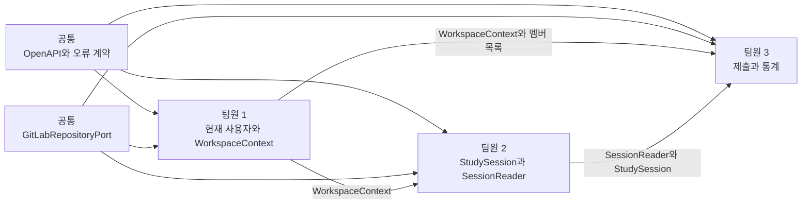

# 3인 팀 백엔드 구현 로드맵

이 문서는 세 명이 역할별 핸드북을 실제 개발 순서로 옮길 때 사용하는 공통 안내서입니다. “각자 무엇을 만들지”뿐 아니라 “언제 서로의 코드가 필요한지”, “무엇을 먼저 합의해야 충돌이 줄어드는지”를 정리합니다.

## 1. 시작 전에 함께 읽을 문서

세 명 모두 아래 순서로 읽습니다.

1. [프로젝트 README](../README.md)
2. [OpenAPI 실행 계약](openapi.yaml)
3. [공통 오류 계약](api-error-catalog.md)
4. [로컬 개발환경](development-environment.md)
5. [협업 규칙](../CONTRIBUTING.md)
6. 자신의 역할 요구사항
7. 자신의 초심자 구현 핸드북

역할별 문서:

| 담당 | 요구사항 | 구현 핸드북 |
|---|---|---|
| 팀원 1 | [인증·Workspace](backend-role-1-auth-workspace.md) | [단계별 핸드북](guides/member-1-auth-workspace-handbook.md) |
| 팀원 2 | [일정·저장소](backend-role-2-session-repository.md) | [단계별 핸드북](guides/member-2-session-repository-handbook.md) |
| 팀원 3 | [제출·기록·점수](backend-role-3-submission-analytics.md) | [단계별 핸드북](guides/member-3-submission-analytics-handbook.md) |

## 2. 전체 의존 관계



팀원 3은 팀원 1과 2의 구현이 완전히 끝날 때까지 기다릴 필요는 없습니다. 인터페이스와 작은 가짜 구현을 먼저 합의하면 병렬로 진행할 수 있습니다.

## 3. 0단계 — 개발 환경 맞추기

모든 팀원이 같은 commit을 받은 뒤 아래를 실행합니다.

```bash
cp .env.example .env
cp backend/.env.example backend/.env
make infra-up
make check
```

확인할 것:

- Java와 Node 버전
- PostgreSQL·Redis 기동
- 프론트 lint·test
- 백엔드 test
- OpenAPI lint
- secret 검사

한 명만 통과하고 다른 사람은 실패한다면 기능 개발을 시작하기 전에 환경 차이를 해결합니다.

### 완료 조건

- [ ] 세 명 모두 `make check` 성공
- [ ] 실제 secret이 Git status에 나타나지 않음
- [ ] GitLab remote와 기본 branch 확인
- [ ] IDE의 Java formatter와 `.editorconfig` 적용

## 4. 1단계 — 공통 계약 회의

이 단계는 세 명이 함께 60~90분 안에 진행합니다. 코드를 많이 작성하는 회의가 아니라 이름과 경계를 고정하는 회의입니다.

### 4.1 OpenAPI 확인

각자 자신의 `x-owner` endpoint를 읽고 아래를 말로 설명합니다.

- 요청 path·query·body
- 성공 응답
- 인증·권한 오류
- 충돌 오류
- 필수·선택 필드

필드가 부족하면 구현 전에 OpenAPI MR을 먼저 만듭니다. 구현 코드에만 필드를 추가하지 않습니다.

### 4.2 공통 Java 계약

먼저 합의할 인터페이스:

```java
public record WorkspaceContext(
    UUID workspaceId,
    long gitLabProjectId,
    String gitLabProjectPath,
    String defaultBranch,
    UUID userId,
    long gitLabUserId,
    String memberId,
    String fileName
) {
}
```

```java
public interface SessionReader {
    StudySession getRequired(
        WorkspaceContext context,
        LocalDate date
    );

    List<StudySession> findRange(
        WorkspaceContext context,
        LocalDate from,
        LocalDate to
    );
}
```

```java
public interface SubmissionReader {
    MemberSubmission findOrEmpty(
        WorkspaceContext context,
        StudySession session,
        WorkspaceMemberView member
    );
}
```

실제 구현 전에는 test fixture를 반환하는 fake를 둘 수 있습니다.

### 4.3 공통 시간 정책

- 저장·비교 타입: `OffsetDateTime` 또는 `Instant`
- 스터디 표시 timezone: `Asia/Seoul`
- 테스트 현재 시각: `Clock` 주입
- 날짜 폴더: `yyMMdd`
- API 날짜: `yyyy-MM-dd`

서비스 안에서 `OffsetDateTime.now()`를 직접 여러 번 호출하지 않습니다.

```java
OffsetDateTime now = OffsetDateTime.now(clock);
```

### 4.4 ID 정책

| 대상 | 타입 | 생성 주체 |
|---|---|---|
| Workspace | UUID | 백엔드 |
| User | UUID | 백엔드 |
| memberId | 안정적인 문자열 | 백엔드 |
| GitLab user/project | long | GitLab |
| Session itemId | 안정적인 문자열 | 백엔드 |
| revision | int | Session domain |
| commit ID | String | GitLab |

화면 표시 이름을 식별자로 사용하지 않습니다.

### 4.5 완료 조건

- [ ] 인터페이스 이름·패키지 결정
- [ ] 날짜·timezone 결정
- [ ] ID 타입 결정
- [ ] 오류 코드 중복 제거
- [ ] 각자 첫 MR의 범위 결정

## 5. 2단계 — 병렬 기반 구현

### 팀원 1

먼저 구현:

1. User·OAuthToken·Workspace·WorkspaceMember 도메인
2. Flyway migration
3. token 암호화 Port와 fake
4. `WorkspaceAccessService`
5. `WorkspaceContext`

팀원 2·3에게 가장 먼저 넘길 결과는 완성된 OAuth가 아니라 `WorkspaceContext` 계약입니다.

### 팀원 2

먼저 구현:

1. StudySession·StudyItem 도메인
2. deadline·revision·path 규칙
3. Session YAML codec
4. `SessionReader`와 fake

팀원 3에게 가장 먼저 넘길 결과는 Controller가 아니라 `StudySession`과 `SessionReader` 계약입니다.

### 팀원 3

먼저 구현:

1. SubmissionEntry·MemberSubmission 도메인
2. 제출 값 검증
3. ProgressCalculator
4. ScoreCalculator
5. 팀원 1·2 인터페이스를 사용하는 fake 기반 서비스 테스트

외부 의존성이 없어도 순수 계산은 바로 시작할 수 있습니다.

### 이 단계에서 금지할 것

- 각 역할에서 별도의 `GitLabClient` 생성
- 팀원 2·3이 Workspace 테이블을 직접 조회해 권한 로직 중복
- 팀원 3이 `session.yml`을 직접 파싱
- Controller DTO를 다른 도메인의 공통 모델로 사용
- 다른 팀원의 패키지 내부 구현 클래스 직접 참조

## 6. 3단계 — GitLab Adapter 연결

공통 `GitLabRepositoryPort`를 사용합니다.

읽기:

```text
사용자·프로젝트 확인
branch 확인
repository tree
repository file
```

쓰기:

```text
branch 생성·정리
file 생성
file 수정 + last_commit_id
file 삭제
```

### 안전 규칙

- 실제 쓰기 테스트는 기본 branch가 아닌 고유 임시 branch
- 테스트 file path에 고유 prefix 사용
- `finally`에서 branch 정리
- 테스트가 실패해도 남은 branch를 검색할 수 있게 이름 규칙 유지
- 실제 프로젝트 ID·token을 출력하지 않음

### 완료 조건

- [ ] 공통 Mock 테스트
- [ ] 환경변수 opt-in 실제 쓰기 테스트
- [ ] 임시 branch 0개 확인
- [ ] 401·403·404·409·429·5xx 매핑

## 7. 4단계 — 역할별 세로 기능 완성

한 기능을 Controller부터 테스트까지 세로로 완성합니다.

### 팀원 1 순서

```text
OAuth 시작
→ callback
→ 현재 사용자
→ GitLab 프로젝트 후보
→ Workspace 생성
→ 멤버 동기화
→ token refresh
```

### 팀원 2 순서

```text
Session 조회
→ 생성
→ 수정
→ 취소
→ 기간 목록
→ 저장소 tree
→ 파일 미리보기
```

### 팀원 3 순서

```text
내 제출 조회
→ item upsert
→ item delete
→ 충돌 처리
→ Dashboard
→ 일별·월별 Records
→ Scores와 순위
```

각 화살표마다 작은 MR을 만들 수 있습니다.

## 8. MR 작업 방식

### branch 이름

```text
feat/member1-workspace-domain
feat/member2-session-yaml
feat/member3-submission-domain
fix/member3-submission-conflict
```

### 한 MR의 권장 크기

- 하나의 사용자 흐름
- 리뷰 가능한 파일 수
- 정상과 대표 오류 테스트 포함
- OpenAPI 변경이 있으면 같은 MR 또는 선행 MR

### MR 전에 실행

```bash
make check
git diff --check
git status
```

### 리뷰어가 확인할 것

1. 요구사항 인수 조건을 만족하는가
2. 다른 역할의 책임을 중복 구현하지 않았는가
3. token·path·권한이 안전한가
4. 실패와 경계 테스트가 있는가
5. OpenAPI와 응답이 같은가
6. 초심자가 이름만 보고 책임을 이해할 수 있는가

## 9. 역할 간 통합 순서

### 통합 1 — WorkspaceContext

팀원 2·3의 fake `WorkspaceAccessService`를 팀원 1 구현으로 교체합니다.

검증:

- 다른 Workspace 접근 403
- client가 보낸 project ID 무시
- client가 보낸 file path 무시

### 통합 2 — SessionReader

팀원 3의 fake Session을 팀원 2의 GitLab SessionReader로 교체합니다.

검증:

- revision 불일치
- cancelled·replaced item 제외
- 1차·2차 마감 timezone

### 통합 3 — Submission과 Analytics

실제 멤버 Markdown을 저장하고 같은 데이터로 Dashboard·Records·Scores를 조회합니다.

검증:

- 저장 직후 진행률 반영
- 수정해도 최초 점수 유지
- 일별과 월별 계산 일치
- 공동 순위
- 캐시 무효화

### 통합 4 — 프론트

프론트 메모리 Provider action을 endpoint 하나씩 교체합니다.

권장 순서:

1. 연결 상태·현재 사용자
2. Workspace
3. Session 읽기
4. Session 쓰기
5. 제출 읽기
6. 제출 쓰기
7. Dashboard
8. Records
9. Scores
10. 저장소

한 번에 전체 Provider를 교체하지 않습니다.

## 10. 공통 테스트 피라미드

### 단위 테스트

대상:

- 날짜·경로
- deadline
- revision
- 제출 병합
- 점수·순위
- token 암호화

가장 빠르고 많아야 합니다.

### 서비스 테스트

대상:

- 권한 확인 순서
- GitLab Port 호출 인자
- 충돌
- cache 무효화
- transaction

Mock 또는 fake Port를 사용합니다.

### Controller 테스트

대상:

- HTTP status
- 요청 validation
- 공통 오류 응답
- OpenAPI와 JSON 일치
- 인증·인가

### 실제 GitLab 통합 테스트

소수의 핵심 흐름만 opt-in으로 실행합니다.

- branch 생성·삭제
- 파일 create·read·update·delete
- last commit 충돌
- scope 부족

## 11. 초심자의 하루 작업 루프

1. 역할 핸드북에서 오늘 단계 하나를 고릅니다.
2. 인수 조건 하나를 실패 테스트로 작성합니다.
3. 테스트를 통과할 최소 코드를 작성합니다.
4. 이름과 중복을 정리합니다.
5. 전체 테스트를 실행합니다.
6. 작은 commit을 만듭니다.
7. MR에 배운 점과 막힌 점을 적습니다.
8. 다른 팀원이 코드를 설명해보게 합니다.

문제가 생겼을 때 코드를 무작정 늘리지 말고 아래 순서로 좁힙니다.

```text
입력 DTO
→ 권한 Context
→ Domain 규칙
→ Codec
→ GitLab Port 인자
→ 응답 DTO
```

## 12. 주간 예시

학습 속도에 따라 늘려도 됩니다.

### 1주차

- 공통 문서·환경
- 도메인과 인터페이스
- fixture
- 순수 단위 테스트

### 2주차

- codec
- GitLab adapter
- 조회 API
- 오류 계약

### 3주차

- 쓰기 API
- revision·commit 충돌
- 권한 통합

### 4주차

- Dashboard·Records·Scores
- 프론트 endpoint 교체
- E2E

### 5주차

- OAuth refresh
- 캐시
- rate limit
- 운영 보안
- 배포

## 13. 회의에서 결정이 필요한 항목

아래는 문서가 기본안을 제안하지만 팀이 최종 확정해야 합니다.

- GitLab에서 본문을 직접 편집한 내용을 앱 저장 시 보존할지
- 오래된 Session revision의 제출 파일을 자동 마이그레이션할지
- 일부 멤버 파일이 손상됐을 때 Dashboard 전체를 실패시킬지
- Session 필수 항목이 0개인 날을 월 평균에 포함할지
- 사용자 커밋 메시지가 비어 있을 때 기본값을 허용할지
- 멤버 탈퇴 후 과거 제출 공개 범위
- OAuth token 재인증 UX
- 보호 branch에 직접 commit할지 MR 방식을 사용할지

결정은 회의에서만 말하고 끝내지 말고 관련 역할 문서와 테스트에 반영합니다.

## 14. 역할별 완료 정의

### 팀원 1

- [ ] OAuth 로그인·callback
- [ ] token 암호화와 refresh
- [ ] Workspace·멤버 DB
- [ ] `WorkspaceAccessService`
- [ ] 프로젝트·멤버 동기화
- [ ] 권한·보안 테스트

### 팀원 2

- [ ] Session YAML round-trip
- [ ] Session 조회·생성·수정·취소
- [ ] revision·last commit 충돌
- [ ] 1·2차 마감
- [ ] 저장소 tree·file 정책
- [ ] pagination·경로 테스트

### 팀원 3

- [ ] 멤버 Markdown round-trip
- [ ] 항목별 제출 병합·제거
- [ ] 최초 제출 시각 보존
- [ ] 같은 item 충돌
- [ ] Dashboard·Records
- [ ] 10·6·0 점수와 공동 순위

### 팀 전체

- [ ] OpenAPI lint
- [ ] 모든 CI job 성공
- [ ] 실제 GitLab 테스트 branch 정리
- [ ] 프론트 핵심 흐름 E2E
- [ ] 운영 의존성 audit
- [ ] secret 검사
- [ ] README 실행 방법 최신화

## 15. 첫 작업 추천

세 명이 다음 세 MR을 동시에 시작하는 것이 좋습니다.

```text
팀원 1
feat: add workspace domain and access context

팀원 2
feat: add session domain and yaml codec

팀원 3
feat: add submission domain and scoring calculators
```

첫 MR에서는 실제 OAuth나 실제 GitLab 쓰기까지 욕심내지 않습니다. 도메인 규칙과 인터페이스, 단위 테스트를 분명히 만들어 다음 통합의 기반을 마련하는 것이 목표입니다.
